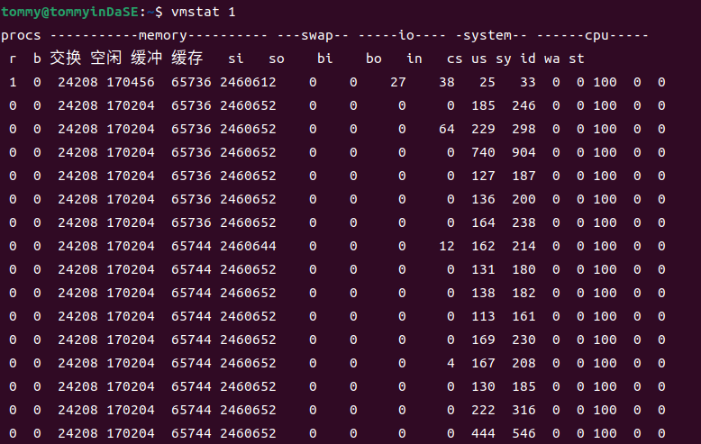
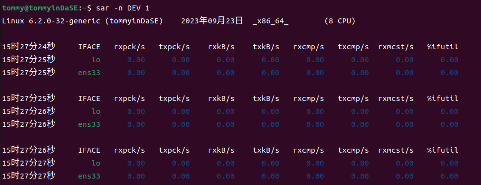

## 1.0 环境搭建和工具安装

### 1.1 安装操作系统

在这门课程的实验中，我选择是在虚拟机中安装Ubuntu系统，而不是WSL（Windows子系统）

首先肯定是下载Ubuntu的安装镜像，我选择的是[Ubuntu 22.04.0](https://releases.ubuntu.com/jammy/).下载完成之后我在VMware中安装(我的VMware版本是VMware Workstation 16 Pro,是符合实验要求的)

在实验文档中，要求安装的Ubuntu内核版本 Linux Kernel 5.10+，然后我看了一下内核版本：


6.2.0是符合要求的。

接下来就是去安装相应的编译和性能剖析工具(GCC 11.0+和 Clang 14.0+,Python 3.8+和Java 11+,Valgrind 3.17+和Linux perf 5.4+)。为了简化安装流程，我采用的是apt-get的方式。

在安装这些软件的过程中，除了安装perf时，我并没有碰到什么问题（有一个注意的就是在安装Java时包名为openjdk-11-jdk），安装之后检验各软件是否安装：


最后来额外说一下perf的安装，包名应该为linux-tools-common，但是sudo apt-get install linux-tools-common之后出现了这样的结果:


在安装好上面那两个对应的依赖包后，perf终于正常了:


## 2. 常用工具命令操作练习

要求：在终端分别执行下述命令，如系统没有，请自行安装。使用man 命令获得相关命令的文档，了解命令用法与选项含义，理解输出的数据，在此基础上回答问题。

提示：部分命令输出结果可能很长，尝试使用管道与 head 命令控制输出的行数，例如： \<cmd\> | head -n 10；部分命令可能需要 sudo 权限才可以正确执行。

### 2.1 uname -a


#### 2.1.a 分析输出结果包含了哪些信息。

"uname -a" means "print  all  information,  in the following order".

那么这个命令到底以什么样的顺序输出呢？这个我在网上并没有确切的答案，但是我通过man手册里的先后顺序，再结合着刚刚uname -a 的输出，我发现可以一一对应。

因此从前到后依次是kernel-name(-s，内核名),nodename(-n，网络结点的主机名),kernel-release(-r，内核的发行版本),kernel-version(-v，内核版本),machine(-m，机器硬件名),processor(-p，处理器类型),hardware-platform(-i，硬件平台),operating-system(-o，操作系统)

然后我从前到后去分析命令的输出结果。

> Linux tommyinDaSE 6.2.0-32-generic #32~22.04.1-Ubuntu SMP PREEMPT_DYNAMIC Fri Aug 18 10:40:13 UTC 2 x86_64 x86_64 x86_64 GNU/Linux

内核名是Linux；网络结点的主机名是tommyinDaSE；内核的发行版本是6.2.0-32-generic；内核版本是#32~22.04.1-Ubuntu SMP PREEMPT_DYNAMIC Fri Aug 18 10:40:13 UTC 2（在这里我上网查了一下资料，SMP表示多核处理器的版本；后面跟的那个时间是这个版本的封装时间）；机器硬件名称x86_64；处理器类型x86_64；硬件平台x86_64；操作系统GNU/Linux。

最后我想说这里的内核版本（-v）和内核的发行版本（-r）在翻译上可能是有点歧义的。众所周知，Linux的内核是其最基本的部分，在此基础之上有了各种各样的发行版本（Linux distribution）。所以从这个角度来说，"-v"调出来的更应该说是发行版本；而"-r"调出来的更应该说是内核版本。

#### 2.1.b Linux 内核版本与指令集架构是什么?

内核版本：6.2.0-32-generic

指令集架构：x86_64

### 2.2 sysctl -a 

调用这个之后会有一长串的输出。

```
abi.vsyscall32 = 1
debug.exception-trace = 1
debug.kprobes-optimization = 1
dev.cdrom.autoclose = 1
dev.cdrom.autoeject = 0
............
```

#### 2.2.a 该命令的功能是什么？-a 选项的含义是什么？ 

在man文档中，我们可以看到sysctl的解释"sysctl  is  used  to  modify  kernel  parameters at runtime. The parameters available are those listed under /proc/sys/. Procfs is required for sysctl support in Linux. You can use sysctl to both read and write sysctl data."(配置、查看内核参数在运行时，这些参数存于/proc/sys/)

-a的意思就是"Display all values currently available."(展示目前可用的所有参数)

#### 2.2.b 输出结果与目录/proc/sys 的关系是什么？ 

通过2.2.a，我知道了这个函数读写的参数存于/proc/sys/。我还在之前就知道Linux中的一切都是文件化的，那么我能不能进这个目录看一下呢？


结合着最开始看到的那长长的输出，我发现了/proc/sys/中各文件和sysctl -a的输出明显的对应关系。看来，Linux下"一切皆文件"的理念名不虚传。

### 2.3 top 


注意：执行该命令后会进入交互式界面，按 q 退出。 

#### 2.3.a 分析输出结果包含了哪些信息，每一栏分别表示什么？

在man文档中，我们可以查到top命令"It can display system summary information as well as a list of processes or threads currently being managed by the Linux kernel.  The types of system  summary  information shown  and  the  types,  order  and  size  of  information  displayed  for  processes  are all user configurable and that configuration can be made persistent across restarts.",简而言之，top提供了一个动态且交互式的实时视图，显示系统的整体性能情况及正在运行的进程的相关信息。

然后对照着man文档，我来一块一块地去分析

1. 在表格之上，就是系统的总体信息，比如当前的任务总数（有多少个任务在运行态，多少个在阻塞态，多少个在就绪/休眠态），总体 CPU 使用率和各个核心的使用情况，总体内存使用情况、可用内存和缓存、swap交换空间情况。
2. 在表格之下就是各进程的信息

| 名称   | 简略解释 |
| ------ | -------- |
| 进程号 | PID,进程号,进程的标识符 |
| USER   | 运行进程的用户名 |
| PR     | Priority,进程的优先级。rt就是实时调度。 |
| NI     | Nice,进程的优先级调整值。如果为负则目前优先级更高，反之亦然。 |
| VIRT   | Virtual Memory Size,虚拟内存,进程使用的虚拟内存大小 |
| RES    | Resident Memory Size,进程实际使用的物理内存大小 |
| SHR    | Shared Memory Size,进程共享的内存大小，这里的内存指的是物理内存。 |
| %CPU   | CPU Usage,进程占用 CPU 的使用率 |
| %MEM   | Memory Usage,进程占用物理内存的使用率 |
| TIME+  | 进程的累计 CPU 时间(自它开始运行算起) |
| COMMAND   | 一个任务或相关程序具体的工作情况                             |

我觉得这里最值得关注的还是物理内存和虚拟内存的差异。

### 2.4 dmidecode 

最开始我这里出现了一些权限问题:


然后我sudo dmidecode之后就有了一大串的输出。

```
# dmidecode 3.3
Getting SMBIOS data from sysfs.
SMBIOS 2.7 present.
620 structures occupying 29956 bytes.
Table at 0x000E0010.

Handle 0x0000, DMI type 0, 24 bytes
BIOS Information
	Vendor: Phoenix Technologies LTD
	Version: 6.00
	Release Date: 11/12/2020
	Address: 0xEA480
	Runtime Size: 88960 bytes
	ROM Size: 64 kB
	Characteristics:
		ISA is supported
		PCI is supported
		PC Card (PCMCIA) is supported
		PNP is supported
		APM is supported
............
```

#### 2.4.a 该命令的功能是什么？ 

在man文档中，我查到了这个命令的功能——通过DMI(Desktop Management Interface,电脑管理接口)获取主机的硬件信息，并将其转化为易读的形式而不必通晓真实但又复杂的硬件。其输出的信息包括BIOS、系统、主板、处理器、内存、缓存等。

#### 2.4.b 观察输出结果，以内存为例，可以获得哪些信息？ 

既然这个只需要内存的相关信息，我的命令就成了`sudo dmidecode -t memory`，然而还是输出了一大堆:

```
............
Handle 0x0220, DMI type 17, 34 bytes
Memory Device
	Array Handle: 0x0025
	Error Information Handle: No Error
	Total Width: 32 bits
	Data Width: 32 bits
	Size: No Module Installed
	Form Factor: DIMM
	Set: None
	Locator: NVD #61
	Bank Locator: NVD #61
	Type: Other
	Type Detail: Unknown
	Speed: Unknown
	Manufacturer: Not Specified
	Serial Number: Not Specified
	Asset Tag: Not Specified
	Part Number: Not Specified
	Rank: Unknown
	Configured Memory Speed: Unknown
............
```

通过观察可以看到每个表的结构是类似的，我对统一的结构进行一下分析:

| 名称                     | 解释                                                         |
| ------------------------ | ------------------------------------------------------------ |
| Array Handle             | 与这个设备相关联的句柄                                       |
| Error Information Handle | 与这个设备相关联的错误信息句柄                               |
| Total Width              | 内存总宽度                                                   |
| Data Width               | 数据宽度                                                     |
| Size                     | 安装的内存模块之大小。这里显示没有安装内存模块。             |
| Form Facto               | 内存模块的物理尺寸。DIMM（Dual Inline Memory Module，双列直插内存模块） |
| Se                       | 内存模块的所属集合                                           |
| Locator                  | 内存模块所在的物理插槽                                       |
| Bank Locator             | 内存模块所在的物理插槽                                       |
| Type                     | 内存类型。比如SRAM,DRAM等                                    |
| Type Detail              | 内存类型的详细信息                                           |
| Speed                    | 内存模块的速度                                               |
| Manufacturer             | 制造商                                                       |
| Serial Number            | 串号                                                         |
| Asset Tag                | 标签值                                                       |
| Part Number              | 零件号码                                                     |
| Rank                     | 内存模块的级别                                               |
| Configured Memory Speed  | 内存模块的配置速度                                           |

上面这一大堆信息还是比较底层的，其中很多信息我们并不是很关心。

### 2.5 numactl -H 


#### 2.5.a 该命令的功能是什么？-H 选项的含义是什么？ 

在man文档中，我们可以看到这个命令的功能是"numactl runs processes with a specific NUMA scheduling or memory placement policy.  The policy is set for command and in‐herited by all of its children.  In addition it can set persistent policy for shared memory segments or files.",简而言之就是这个命令用特定的 NUMA （Non-Uniform Memory Access，非一致性内存访问）调度或内存放置策略运行进程。该策略对命令进行设置，并被所有子进程继承。并且它还可以为共享内存段或者文件设置持久性的策略。

NUMA 是一种计算机体系结构，其中多个处理器核心和内存模块被组织成节点，每个节点有自己的本地内存。这样使得系统中的内存并非全局可访问，是分布于多个节点的，每个节点也都与某个处理器核心关联了起来。-H参数可以显示目前系统上可以使用的节点。

#### 2.5.b NUMA 节点数量有多少个？ 

我们透过结果可以很容易地看到只存在1个节点0。

### 2.6 lscpu 与cat /proc/cpuinfo 

#### 2.6.a 以 lscpu 为例，分析输出结果包含了哪些信息。 

我的输出如下:

```
tommy@tommyinDaSE:~$ lscpu
架构：                   x86_64
  CPU 运行模式：         32-bit, 64-bit
  Address sizes:         45 bits physical, 48 bits virtual
  字节序：               Little Endian
CPU:                     8
  在线 CPU 列表：        0-7
厂商 ID：                AuthenticAMD
  型号名称：             AMD Ryzen 7 4800H with Radeon Graphics
    CPU 系列：           23
    型号：               96
    每个核的线程数：     1
    每个座的核数：       2
    座：                 4
    步进：               1
    BogoMIPS：           5789.12
    标记：               fpu vme de pse tsc msr pae mce cx8 apic sep mtrr pge mca cmov pat pse36 clflush mmx fxsr sse sse2 ht syscal
                         l nx mmxext fxsr_opt pdpe1gb rdtscp lm constant_tsc rep_good nopl tsc_reliable nonstop_tsc cpuid extd_apici
                         d tsc_known_freq pni pclmulqdq ssse3 fma cx16 sse4_1 sse4_2 x2apic movbe popcnt aes xsave avx f16c rdrand h
                         ypervisor lahf_lm cmp_legacy extapic cr8_legacy abm sse4a misalignsse 3dnowprefetch osvw topoext ssbd ibpb 
                         vmmcall fsgsbase bmi1 avx2 smep bmi2 rdseed adx smap clflushopt clwb sha_ni xsaveopt xsavec xgetbv1 clzero 
                         wbnoinvd arat umip rdpid overflow_recov succor
Virtualization features: 
  超管理器厂商：         VMware
  虚拟化类型：           完全
Caches (sum of all):     
  L1d:                   256 KiB (8 instances)
  L1i:                   256 KiB (8 instances)
  L2:                    4 MiB (8 instances)
  L3:                    16 MiB (4 instances)
NUMA:                    
  NUMA 节点：            1
  NUMA 节点0 CPU：       0-7
Vulnerabilities:         
  Gather data sampling:  Not affected
  Itlb multihit:         Not affected
  L1tf:                  Not affected
  Mds:                   Not affected
  Meltdown:              Not affected
  Mmio stale data:       Not affected
  Retbleed:              Mitigation; untrained return thunk; SMT disabled
  Spec store bypass:     Mitigation; Speculative Store Bypass disabled via prctl
  Spectre v1:            Mitigation; usercopy/swapgs barriers and __user pointer sanitization
  Spectre v2:            Mitigation; Retpolines, IBPB conditional, STIBP disabled, RSB filling, PBRSB-eIBRS Not affected
  Srbds:                 Not affected
  Tsx async abort:       Not affected

```

这个包含的信息实在是太多了，我找到了各自的含义，这也就是包含了的所有信息：

1. 架构：计算机的体系架构，这里是 x86_64（64位）
2. CPU 运行模式：这里支持32位和64位。
3. Address sizes：物理地址大小和虚拟地址大小
4. 字节序：这里是Little Endian（小端），数据的最低位存储在最低地址处。
5. CPU：CPU核心数，有8个。
6. 在线 CPU 列表：列出在线的CPU核心，这里是0-7。
7. 厂商 ID：CPU制造商，这里是AuthenticAMD，表示AMD的CPU。
8. 型号名称：CPU型号名，这里是AMD Ryzen 7 4800H with Radeon Graphics。
9. CPU 系列和型号
10. 每个核的线程数、每个座的核数
11. 座：座的数量，这里有4个座。
12. 步进：CPU的步进信息，这里是1。
13. BogoMIPS：CPU性能的估算值，这里是5789.12
14. 标记：CPU支持的特性和指令集，这里包括FPU、VME、DE等。
15. Virtualization features：虚拟化特性。包括超管理器厂商和虚拟化类型。
16. Caches：CPU的缓存信息。（我们可以把它理解为SRAM）包括L1d、L1i、L2和L3缓存的大小。
17. NUMA：NUMA相关信息，包括NUMA节点数和每个NUMA节点上的CPU核心数。
18. Vulnerabilities：CPU的安全漏洞。

#### 2.6.b 处理器型号是什么？包含多少个物理核（physical core）？是否有硬件线程（hardware thread）？ 

处理器的型号是AMD Ryzen 7 4800H with Radeon Graphics

物理核有8个

什么是硬件线程呢？硬件线程是一种在单个物理处理器核心上模拟多个线程的执行单元，是线程在硬件执行资源上的表现形式。由于"每个核的线程数"为1，没有超线程，故没有硬件线程。

#### 2.6.c 简要比较两种命令的差别。

我的cat /proc/cpuinfo 输出见下方。

我们能发现这两个命令都可以查看CPU的信息。但是通过对比，结合着文档，我们能发现它们的不同主要在于搜集信息的源头不同：lscpu从sysfs、/proc/cpuinfo,、任何可使用的特定数据库获取信息，搜集地更全（lscpu gathers CPU architecture information from sysfs, /proc/cpuinfo and any applicable architecture-specific libraries (e.g. librtas on Powerpc).）。 /proc/cpuinfo中的信息只是lscpu能调取的信息一部分。

```
tommy@tommyinDaSE:~$ cat /proc/cpuinfo 
processor	: 0
vendor_id	: AuthenticAMD
cpu family	: 23
model		: 96
model name	: AMD Ryzen 7 4800H with Radeon Graphics
stepping	: 1
microcode	: 0x8600103
cpu MHz		: 2894.564
cache size	: 512 KB
physical id	: 0
siblings	: 2
core id		: 0
cpu cores	: 2
apicid		: 0
initial apicid	: 0
fpu		: yes
fpu_exception	: yes
cpuid level	: 16
wp		: yes
flags		: fpu vme de pse tsc msr pae mce cx8 apic sep mtrr pge mca cmov pat pse36 clflush mmx fxsr sse sse2 ht syscall nx mmxext fxsr_opt pdpe1gb rdtscp lm constant_tsc rep_good nopl tsc_reliable nonstop_tsc cpuid extd_apicid tsc_known_freq pni pclmulqdq ssse3 fma cx16 sse4_1 sse4_2 x2apic movbe popcnt aes xsave avx f16c rdrand hypervisor lahf_lm cmp_legacy extapic cr8_legacy abm sse4a misalignsse 3dnowprefetch osvw topoext ssbd ibpb vmmcall fsgsbase bmi1 avx2 smep bmi2 rdseed adx smap clflushopt clwb sha_ni xsaveopt xsavec xgetbv1 clzero wbnoinvd arat umip rdpid overflow_recov succor
bugs		: fxsave_leak sysret_ss_attrs null_seg spectre_v1 spectre_v2 spec_store_bypass retbleed smt_rsb
bogomips	: 5789.12
TLB size	: 3072 4K pages
clflush size	: 64
cache_alignment	: 64
address sizes	: 45 bits physical, 48 bits virtual
power management:

processor	: 1
vendor_id	: AuthenticAMD
cpu family	: 23
model		: 96
model name	: AMD Ryzen 7 4800H with Radeon Graphics
stepping	: 1
microcode	: 0x8600103
cpu MHz		: 2894.564
cache size	: 512 KB
physical id	: 0
siblings	: 2
core id		: 1
cpu cores	: 2
apicid		: 1
initial apicid	: 1
fpu		: yes
fpu_exception	: yes
cpuid level	: 16
wp		: yes
flags		: fpu vme de pse tsc msr pae mce cx8 apic sep mtrr pge mca cmov pat pse36 clflush mmx fxsr sse sse2 ht syscall nx mmxext fxsr_opt pdpe1gb rdtscp lm constant_tsc rep_good nopl tsc_reliable nonstop_tsc cpuid extd_apicid tsc_known_freq pni pclmulqdq ssse3 fma cx16 sse4_1 sse4_2 x2apic movbe popcnt aes xsave avx f16c rdrand hypervisor lahf_lm cmp_legacy extapic cr8_legacy abm sse4a misalignsse 3dnowprefetch osvw topoext ssbd ibpb vmmcall fsgsbase bmi1 avx2 smep bmi2 rdseed adx smap clflushopt clwb sha_ni xsaveopt xsavec xgetbv1 clzero wbnoinvd arat umip rdpid overflow_recov succor
bugs		: fxsave_leak sysret_ss_attrs null_seg spectre_v1 spectre_v2 spec_store_bypass retbleed smt_rsb
bogomips	: 5789.12
TLB size	: 3072 4K pages
clflush size	: 64
cache_alignment	: 64
address sizes	: 45 bits physical, 48 bits virtual
power management:

processor	: 2
vendor_id	: AuthenticAMD
cpu family	: 23
model		: 96
model name	: AMD Ryzen 7 4800H with Radeon Graphics
stepping	: 1
microcode	: 0x8600103
cpu MHz		: 2894.564
cache size	: 512 KB
physical id	: 1
siblings	: 2
core id		: 0
cpu cores	: 2
apicid		: 2
initial apicid	: 2
fpu		: yes
fpu_exception	: yes
cpuid level	: 16
wp		: yes
flags		: fpu vme de pse tsc msr pae mce cx8 apic sep mtrr pge mca cmov pat pse36 clflush mmx fxsr sse sse2 ht syscall nx mmxext fxsr_opt pdpe1gb rdtscp lm constant_tsc rep_good nopl tsc_reliable nonstop_tsc cpuid extd_apicid tsc_known_freq pni pclmulqdq ssse3 fma cx16 sse4_1 sse4_2 x2apic movbe popcnt aes xsave avx f16c rdrand hypervisor lahf_lm cmp_legacy extapic cr8_legacy abm sse4a misalignsse 3dnowprefetch osvw topoext ssbd ibpb vmmcall fsgsbase bmi1 avx2 smep bmi2 rdseed adx smap clflushopt clwb sha_ni xsaveopt xsavec xgetbv1 clzero wbnoinvd arat umip rdpid overflow_recov succor
bugs		: fxsave_leak sysret_ss_attrs null_seg spectre_v1 spectre_v2 spec_store_bypass retbleed smt_rsb
bogomips	: 5789.12
TLB size	: 3072 4K pages
clflush size	: 64
cache_alignment	: 64
address sizes	: 45 bits physical, 48 bits virtual
power management:

processor	: 3
vendor_id	: AuthenticAMD
cpu family	: 23
model		: 96
model name	: AMD Ryzen 7 4800H with Radeon Graphics
stepping	: 1
microcode	: 0x8600103
cpu MHz		: 2894.564
cache size	: 512 KB
physical id	: 1
siblings	: 2
core id		: 1
cpu cores	: 2
apicid		: 3
initial apicid	: 3
fpu		: yes
fpu_exception	: yes
cpuid level	: 16
wp		: yes
flags		: fpu vme de pse tsc msr pae mce cx8 apic sep mtrr pge mca cmov pat pse36 clflush mmx fxsr sse sse2 ht syscall nx mmxext fxsr_opt pdpe1gb rdtscp lm constant_tsc rep_good nopl tsc_reliable nonstop_tsc cpuid extd_apicid tsc_known_freq pni pclmulqdq ssse3 fma cx16 sse4_1 sse4_2 x2apic movbe popcnt aes xsave avx f16c rdrand hypervisor lahf_lm cmp_legacy extapic cr8_legacy abm sse4a misalignsse 3dnowprefetch osvw topoext ssbd ibpb vmmcall fsgsbase bmi1 avx2 smep bmi2 rdseed adx smap clflushopt clwb sha_ni xsaveopt xsavec xgetbv1 clzero wbnoinvd arat umip rdpid overflow_recov succor
bugs		: fxsave_leak sysret_ss_attrs null_seg spectre_v1 spectre_v2 spec_store_bypass retbleed smt_rsb
bogomips	: 5789.12
TLB size	: 3072 4K pages
clflush size	: 64
cache_alignment	: 64
address sizes	: 45 bits physical, 48 bits virtual
power management:

processor	: 4
vendor_id	: AuthenticAMD
cpu family	: 23
model		: 96
model name	: AMD Ryzen 7 4800H with Radeon Graphics
stepping	: 1
microcode	: 0x8600103
cpu MHz		: 2894.564
cache size	: 512 KB
physical id	: 2
siblings	: 2
core id		: 0
cpu cores	: 2
apicid		: 4
initial apicid	: 4
fpu		: yes
fpu_exception	: yes
cpuid level	: 16
wp		: yes
flags		: fpu vme de pse tsc msr pae mce cx8 apic sep mtrr pge mca cmov pat pse36 clflush mmx fxsr sse sse2 ht syscall nx mmxext fxsr_opt pdpe1gb rdtscp lm constant_tsc rep_good nopl tsc_reliable nonstop_tsc cpuid extd_apicid tsc_known_freq pni pclmulqdq ssse3 fma cx16 sse4_1 sse4_2 x2apic movbe popcnt aes xsave avx f16c rdrand hypervisor lahf_lm cmp_legacy extapic cr8_legacy abm sse4a misalignsse 3dnowprefetch osvw topoext ssbd ibpb vmmcall fsgsbase bmi1 avx2 smep bmi2 rdseed adx smap clflushopt clwb sha_ni xsaveopt xsavec xgetbv1 clzero wbnoinvd arat umip rdpid overflow_recov succor
bugs		: fxsave_leak sysret_ss_attrs null_seg spectre_v1 spectre_v2 spec_store_bypass retbleed smt_rsb
bogomips	: 5789.12
TLB size	: 3072 4K pages
clflush size	: 64
cache_alignment	: 64
address sizes	: 45 bits physical, 48 bits virtual
power management:

processor	: 5
vendor_id	: AuthenticAMD
cpu family	: 23
model		: 96
model name	: AMD Ryzen 7 4800H with Radeon Graphics
stepping	: 1
microcode	: 0x8600103
cpu MHz		: 2894.564
cache size	: 512 KB
physical id	: 2
siblings	: 2
core id		: 1
cpu cores	: 2
apicid		: 5
initial apicid	: 5
fpu		: yes
fpu_exception	: yes
cpuid level	: 16
wp		: yes
flags		: fpu vme de pse tsc msr pae mce cx8 apic sep mtrr pge mca cmov pat pse36 clflush mmx fxsr sse sse2 ht syscall nx mmxext fxsr_opt pdpe1gb rdtscp lm constant_tsc rep_good nopl tsc_reliable nonstop_tsc cpuid extd_apicid tsc_known_freq pni pclmulqdq ssse3 fma cx16 sse4_1 sse4_2 x2apic movbe popcnt aes xsave avx f16c rdrand hypervisor lahf_lm cmp_legacy extapic cr8_legacy abm sse4a misalignsse 3dnowprefetch osvw topoext ssbd ibpb vmmcall fsgsbase bmi1 avx2 smep bmi2 rdseed adx smap clflushopt clwb sha_ni xsaveopt xsavec xgetbv1 clzero wbnoinvd arat umip rdpid overflow_recov succor
bugs		: fxsave_leak sysret_ss_attrs null_seg spectre_v1 spectre_v2 spec_store_bypass retbleed smt_rsb
bogomips	: 5789.12
TLB size	: 3072 4K pages
clflush size	: 64
cache_alignment	: 64
address sizes	: 45 bits physical, 48 bits virtual
power management:

processor	: 6
vendor_id	: AuthenticAMD
cpu family	: 23
model		: 96
model name	: AMD Ryzen 7 4800H with Radeon Graphics
stepping	: 1
microcode	: 0x8600103
cpu MHz		: 2894.564
cache size	: 512 KB
physical id	: 3
siblings	: 2
core id		: 0
cpu cores	: 2
apicid		: 6
initial apicid	: 6
fpu		: yes
fpu_exception	: yes
cpuid level	: 16
wp		: yes
flags		: fpu vme de pse tsc msr pae mce cx8 apic sep mtrr pge mca cmov pat pse36 clflush mmx fxsr sse sse2 ht syscall nx mmxext fxsr_opt pdpe1gb rdtscp lm constant_tsc rep_good nopl tsc_reliable nonstop_tsc cpuid extd_apicid tsc_known_freq pni pclmulqdq ssse3 fma cx16 sse4_1 sse4_2 x2apic movbe popcnt aes xsave avx f16c rdrand hypervisor lahf_lm cmp_legacy extapic cr8_legacy abm sse4a misalignsse 3dnowprefetch osvw topoext ssbd ibpb vmmcall fsgsbase bmi1 avx2 smep bmi2 rdseed adx smap clflushopt clwb sha_ni xsaveopt xsavec xgetbv1 clzero wbnoinvd arat umip rdpid overflow_recov succor
bugs		: fxsave_leak sysret_ss_attrs null_seg spectre_v1 spectre_v2 spec_store_bypass retbleed smt_rsb
bogomips	: 5789.12
TLB size	: 3072 4K pages
clflush size	: 64
cache_alignment	: 64
address sizes	: 45 bits physical, 48 bits virtual
power management:

processor	: 7
vendor_id	: AuthenticAMD
cpu family	: 23
model		: 96
model name	: AMD Ryzen 7 4800H with Radeon Graphics
stepping	: 1
microcode	: 0x8600103
cpu MHz		: 2894.564
cache size	: 512 KB
physical id	: 3
siblings	: 2
core id		: 1
cpu cores	: 2
apicid		: 7
initial apicid	: 7
fpu		: yes
fpu_exception	: yes
cpuid level	: 16
wp		: yes
flags		: fpu vme de pse tsc msr pae mce cx8 apic sep mtrr pge mca cmov pat pse36 clflush mmx fxsr sse sse2 ht syscall nx mmxext fxsr_opt pdpe1gb rdtscp lm constant_tsc rep_good nopl tsc_reliable nonstop_tsc cpuid extd_apicid tsc_known_freq pni pclmulqdq ssse3 fma cx16 sse4_1 sse4_2 x2apic movbe popcnt aes xsave avx f16c rdrand hypervisor lahf_lm cmp_legacy extapic cr8_legacy abm sse4a misalignsse 3dnowprefetch osvw topoext ssbd ibpb vmmcall fsgsbase bmi1 avx2 smep bmi2 rdseed adx smap clflushopt clwb sha_ni xsaveopt xsavec xgetbv1 clzero wbnoinvd arat umip rdpid overflow_recov succor
bugs		: fxsave_leak sysret_ss_attrs null_seg spectre_v1 spectre_v2 spec_store_bypass retbleed smt_rsb
bogomips	: 5789.12
TLB size	: 3072 4K pages
clflush size	: 64
cache_alignment	: 64
address sizes	: 45 bits physical, 48 bits virtual
power management:

```

### 2.7 free


#### 2.7.a 分析输出结果，解释结果显示两行数据的含义。

在man文档中，"free displays the total amount of free and used physical and swap memory in the system, as well as the buffers and caches used by the kernel. The information is gathered by parsing /proc/meminfo."——简而言之，free显示了系统中的所有空闲和已使用的物理内存和交换内存空间，以及内核使用的缓冲区和高速缓存。

两行数据分别代表物理内存和交换内存的各项指标。我主要是想来探讨一下对于某一行而言各列的意思：

| 名称       | 解释                                                         |
| ---------- | ------------------------------------------------------------ |
| total      | 总数                                                         |
| used       | 已使用                                                       |
| free       | 未使用                                                       |
| shared     | tmpfs使用最多的内存                                          |
| buff/cache | buffers&cache两个字段之和                                    |
| available  | 不考虑交换时，考虑页面缓存和slabs，对启动新应用可用内存的估算。 |

其实还有两个隐藏的没有被显示，但是在man文档里有，我就多说一下吧：

1. buffers 被内核缓冲区使用的内存 (Beffers in /proc/meminfo)
2. cache 被页缓存和slabs使用的内存(Cached & SReclaimable in /proc/meminfo)

还有个值得注意的点就是used =  total - free - buffers - cache

#### 2.7.b 这些数据以什么为单位的？

答案就在man文档中:


默认是以kb作为单位的。

### 2.8 vmstat 1



查阅man文档，可得知vmstat会报告关于进程，内存，页，IO，陷入内核(trap)，硬盘和cpu活动的信息。(vmstat  reports  information about processes, memory, paging, block IO, traps, disks and cpu activity.)

第一个生成的报告提供了自上次启动以来的平均值。额外的报告提供了一个持续时间为延迟的采样周期的信息。两种情况下，进程和内存报告都是瞬时值。(The first report produced gives averages since the last reboot.   Additional  reports  give information on a sampling period of length delay.The process and memory reports are instantaneous in either case.)

更新之间的延迟以秒为单位。如果没有指定延迟，那么只会打印一个报告，其中包含自启动以来的平均值。（The delay between updates in seconds.  If no delay is specified, only one report is printed with the average values since boot.）

vmstat的标准写法是vmstat [options] [delay [count]]，count表示产生报告的时间间隔 （Number  of updates.  In absence of count, when delay is defined, default is infinite.）vmstat 1会每秒生成一个新的报告，其中包含了在上一秒内系统的运行状态和性能指标。

### 2.9 mpstat -P ALL 1


通过查阅man文档，我知道了mpstat是用来报告处理器相关的统计信息。(Report processors related statistics.)

然后利用-P参数，mpstat指示了要报告统计信息的处理器。标准的写法应该是mpstat -P {cpu_list | ALL} cpu_list 是一个以逗号分隔的数值列表或数值范围(处理器 0 是第一个处理器，处理器 all 表示所有处理器的全局平均值)离线的处理器这里不会显示。

man文档中有个例子mpstat -P ALL 2 5，它的含义是以两秒的间隔显示所有处理器的五份统计报告。（ Display  five  reports  of  statistics for all processors at two second intervals.）

在这个实践中，我们看的数据来源于所有的处理器，并且以1秒钟为间隔来生成报告。

### 2.10 pidstat 1


通过查阅man文档，我知道了pidstat是用来报告Linux任务的统计信息。(Report statistics for Linux tasks.)

它能用于监视当前由Linux内核管理的各个任务。不选择任何任务相当于指定 -p ALL，但只有活动任务（具有非零统计值的任务）将出现在报告中。（Not  selecting  any tasks  is  equivalent to specifying -p ALL but only active tasks (tasks with non-zero statistics values) will appear in the report.）它将活动信息写入标准输出，对于每个使用选项 -p 选择的任务，或者如果使用了选项 -p ALL，则对由Linux内核管理的每个任务进行监视。（It writes to standard output activities  for every task selected with option -p or for every task managed       by the Linux kernel if option -p ALL has been used. ）

然后在man文档中，有一个命令的示例：

> pidstat 2 5
>               Display  five reports of CPU statistics for every active task in
>               the system at two second intervals.

可以看到这个示例的意思是以两秒的间隔显示系统中每个活动任务的五份CPU统计报告。

那么这个实践中的pidstat 1意思是什么呢？

以1秒的间隔显示系统中每个活动任务的统计报告，一直持续下去，生成无穷的报告。（所以这里才要按ctrl c 停止生成）

### 2.11 iostat -xz 1


通过查阅man文档，我知道了iostat是用来报告CPU的统计信息及设备和分区的输入/输出统计信息。（Report Central Processing Unit (CPU) statistics and input/output statistics for devices and partitions.）

它用于通过观察设备活动时间与其平均传输速率的关系来监视系统输入/输出设备的负载情况。（The iostat command is used for monitoring  system  input/output  device loading  by  observing  the  time the devices are active in relation to their average transfer rates. ）

然后对于-x参数，用处是显示拓展统计信息（Display extended statistics.）；-z参数的用处是让iostat在采样期间没有活动的设备上不要输出。（Tell iostat to omit output for any devices for which  there  was no activity during the sample period.）

接下来还是看man文档中的示例，有一个是这样的iostat -d 2,意思是以2秒的间隔显示持续性的设备报告。

然后这个实践中的iostat -xz 1 表示以1秒为间隔显示持续性的相关报告（当前活跃、拓展的统计信息）。

注意：可以通过 ctrl+C 终止上述命令的执行。

#### 2.11.a 对于2.8到2.11这 4 条命令，命令传入的参数 1 表示什么意思？

这4条命令传入的参数1表示的含义都是以1秒为间隔来生成相应的报告。

#### 2.11.b 比较这 4 条命令分别统计了哪些方面信息。

具体的介绍其实在上面我已经说明，这里汇总起来简单摘要一下。

1. vmstat会报告关于进程，内存，页，IO，陷入内核(trap)，硬盘和cpu活动的信息。(vmstat  reports  information about processes, memory, paging, block IO, traps, disks and cpu activity.)

2. mpstat是用来报告处理器相关的统计信息。(Report processors related statistics.)

3. pidstat是用来报告Linux任务的统计信息。(Report statistics for Linux tasks.)

4. iostat是用来报告CPU的统计信息及设备和分区的输入/输出统计信息。（Report Central Processing Unit (CPU) statistics and input/output statistics for devices and partitions.）

### 2.12 sar -n DEV 1 



通过man文档，我知道了sar是用来收集、报告或保存系统活动信息。（Collect, report, or save system activity information.）

-n参数的标准写法是-n { keyword[,...] | ALL }，用处是报告网络统计信息。

Possible keywords are DEV, EDEV, FC, ICMP, EICMP, ICMP6, EICMP6, IP, EIP, IP6, EIP6, NFS, NFSD, SOCK, SOCK6, SOFT, TCP, ETCP, UDP and UDP6.

如果使用DEV关键词，会报告来自网络设备的统计信息如下表所示。（With the DEV keyword, statistics from the network devices are reported. ）

```
 The  following values are displayed:

              IFACE  Name of the network interface for which statistics are reported.

              rxpck/s
                     Total number of packets received per second.

              txpck/s
                     Total number of packets transmitted per second.

              rxkB/s Total number of kilobytes received per second.

              txkB/s Total number of kilobytes transmitted per second.

              rxcmp/s
                     Number of compressed packets received per second (for cslip etc.).

              txcmp/s
                     Number of compressed packets transmitted per second.

              rxmcst/s
                     Number of multicast packets received per second.

			 %ifutil
                     Utilization  percentage of the network interface. For half-duplex interfaces, utilization is calculated using the sum of rxkB/s and txkB/s as a percentage of the interface  speed.  For  full-duplex,  this  is  the greater of rxkB/S or txkB/s.

```

然后结合具体的示例来看：

> sar -u 2 5
>               Report CPU utilization for each 2 seconds. 5 lines are displayed.

每2秒报告一次CPU利用率。显示5行。

#### 2.12.a 命令传入的参数 1 表示什么意思？ 

意思是说每 1 秒报告，无次数限制。

#### 2.12.b 选项-n DEV，会获得哪些性能数据？

-n DEV将报告所有从网络设备中获得的统计信息。所有网络接口的统计信息都会被报告，除非我们用--iface==指定需要的信息。（Statistics for all network interfaces are displayed unless a restricted list is specified using option --iface= (see corresponding option entry). ）

1. IFACE：网络接口的名字

2. rxpck/s：每秒收到的包的总数

3. rxkB/s：每秒下载的KB数 txkB/s：每秒传输的KB数

4. rxcmp/s：每秒下载的压缩包的总数 txcmp/s：每秒传输的压缩包的总数

5. rxmcst/s：每秒接收到的多播数据包的总数

6. %ifutil：网络接口利用率

这便是得到的各性能数据

### 3. MIT6.172 “Homework 1: Getting Started”

#### 3.1 Write-up 2

Answer the questions in the comments in pointer.c. For example, why are some of the statements valid and some are not? 

我在原本的pointer.c之注释后面添加了自己的答案，如下所示:

```c
int main(int argc, char * argv[]) {  // What is the type of argv? argv是一个数组，数组中的元素是指向char型变量的指针。
  int i = 5;
  // The & operator here gets the address of i and stores it into pi
  int * pi = &i;
  // The * operator here dereferences pi and stores the value -- 5 --
  // into j.
  int j = *pi;

  char c[] = "6.172";
  char * pc = c;  // Valid assignment: c acts like a pointer to c[0] here.
  char d = *pc;
  printf("char d = %c\n", d);  // What does this print? 输出是char d = 6

  // compound types are read right to left in C.
  // pcp is a pointer to a pointer to a char, meaning that
  // pcp stores the address of a char pointer.
  char ** pcp;
  pcp = argv;  // Why is this assignment valid? 
  // pcp 是一个指针，指向的东西是"指向char类型的指针"
  // argv 可以代表 argv[]数组的第一个元素的指针，即指向"指向char类型的指针"(也就是argv[]数组中的元素类型)的指针
  // 两种类型相同，都是char ** 型，因此是有效的。

  const char * pcc = c;  // pcc is a pointer to char constant
  char const * pcc2 = c;  // What is the type of pcc2? 
  // 关键是要看谁离const比较近,这两个const修饰的都是char。const char *p和char const *p意思相同,p都是一个指向const char类型的指针
  // c可以理解为一个指向"6.172"这个字符串首字符的指针 那么pcc2就是一个指向char const类型的指针

  // For each of the following, why is the assignment:
  *pcc = '7';  // invalid? 非法 pcc指向的是一个常量，那个被指的常量不容修改，因此修改pcc的引用非法

  // 虽然pcc指向的是一个常量，但是pcc本身不是个常量。
  pcc = *pcp;  // valid? 合法 pcc是一个指向const char型的指针，*pcp是一个指向char的指针，类型也相同
  pcc = argv[0];  // valid? 合法 pcc是一个指向const char型的指针，argv[0]是一个指向char的指针，类型也相同

  char * const cp = c;  // cp is a const pointer to char
  // For each of the following, why is the assignment:
  // 这里的情况就和上面的大不相同了。这里const修饰的是cp。cp是一个是一个指向char型的指针。
  cp = *pcp;  // invalid? 非法。cp本身无法被修改
  cp = *argv;  // invalid? 非法。cp本身无法被修改
  *cp = '!';  // valid? 合法。虽然cp本身是无法修改的,但它指向的内容是可以修改的。

  const char * const cpc = c;  // cpc is a const pointer to char const
  // For each of the following, why is the assignment:
  // 拆分来看这个问题，const既修饰cpc,也修饰char.cp是一个是一个指向char型的指针。
  cpc = *pcp;  // invalid? 非法。cpc本身无法变化。
  cpc = argv[0];  // invalid? 非法。cpc本身无法变化。
  *cpc = '@';  // invalid? 非法。cpc所指向的内容也不能改变。

  return 0;
}
```


#### 3.2 Write-up 3

For each of the types in the sizes.c exercise above, print the size of a pointer to that type. Recall that obtaining the address of an array or struct requires the & operator. Provide the output of your program (which should include the sizes of both the actual type and a pointer to it) in the writeup. 

我对sizes.c进行了一些修改。结合本来就有的注释提示，我们可以"stringification",即通过宏定义来输出各项数据。

```c
// Copyright (c) 2012 MIT License by 6.172 Staff

#include <stdio.h>
#include <stdlib.h>
#include <stdint.h>
#define PRINT_SIZE(typename,type) printf("size of %s : %zu bytes\n", (typename), sizeof(type) )

int main() {
  // Please print the sizes of the following types:
  // int, short, long, char, float, double, unsigned int, long long
  // uint8_t, uint16_t, uint32_t, and uint64_t, uint_fast8_t,
  // uint_fast16_t, uintmax_t, intmax_t, __int128, and student

  // Here's how to show the size of one type. See if you can define a macro
  // to avoid copy pasting this code.
  // printf("size of %s : %zu bytes \n", "int", sizeof(int));
  // e.g. PRINT_SIZE("int", int);
  //      PRINT_SIZE("short", short);

  // Alternatively, you can use stringification
  // (https://gcc.gnu.org/onlinedocs/cpp/Stringification.html) so that
  // you can write
  // e.g. PRINT_SIZE(int);
  //      PRINT_SIZE(short);

  // Composite types have sizes too.
  int a;PRINT_SIZE("int",int);PRINT_SIZE("int*",&a);
  short b;PRINT_SIZE("short",short);PRINT_SIZE("short*",&b);
  long c;PRINT_SIZE("long",long );PRINT_SIZE("long*",&c);
  char d;PRINT_SIZE("char",char );PRINT_SIZE("char*",&d);
  float e;PRINT_SIZE("float",float );PRINT_SIZE("float*",&e);
  double f;PRINT_SIZE("double",double );PRINT_SIZE("double*",&f);
  unsigned int g;PRINT_SIZE("unsigned int",unsigned int);PRINT_SIZE("unsigned int*",&g);
  long long h;PRINT_SIZE("long long",long long );PRINT_SIZE("long long*",&h);
  uint8_t i;PRINT_SIZE("uint8_t",uint8_t);PRINT_SIZE("uint8_t*",&i);
  uint16_t j;PRINT_SIZE("uint16_t",uint16_t);PRINT_SIZE("uint16_t*",&j);
  uint32_t k;PRINT_SIZE("uint32_t",uint32_t);PRINT_SIZE("uint32_t*",&k);
  uint64_t l;PRINT_SIZE("uint64_t",uint64_t);PRINT_SIZE("uint64_t*",&l);
  uint_fast8_t m;PRINT_SIZE("uint_fast8_t",uint_fast8_t);PRINT_SIZE("uint_fast8_t*",&m);
  uint_fast16_t n;PRINT_SIZE("uint_fast16_t",uint_fast16_t);PRINT_SIZE("uint_fast16_t*",&n);
  uint_fast32_t o;PRINT_SIZE("uint_fast32_t",uint_fast32_t);PRINT_SIZE("uint_fast32_t*",&o);
  uintmax_t p;PRINT_SIZE("uintmax_t",uintmax_t);PRINT_SIZE("uintmax_t*",&p);
  intmax_t q;PRINT_SIZE("intmax_t",intmax_t);PRINT_SIZE("intmax_t*",&q);
  __int128 r;PRINT_SIZE("__int128",__int128);PRINT_SIZE("__int128*",&r);
    
  typedef struct {
    int id;
    int year;
  } student;

  student you;
  you.id = 12345;
  you.year = 4;


  // Array declaration. Use your macro to print the size of this.
  int x[5];

  // You can just use your macro here instead: PRINT_SIZE("student", you);
  printf("size of %s : %zu bytes \n", "x", sizeof(x));
  printf("size of %s : %zu bytes \n", "student", sizeof(you));

  return 0;
}

```

在编译阶段我的程序用gcc编译的话显示"__int128"不支持。然后我查了一些资料，发现这个在Windows环境下确实会出现这样的问题，所以我把这段程序放到了虚拟机的Linux环境下编译并执行，就没什么问题了。

输出结果是

```
size of int : 4 bytes
size of int* : 8 bytes
size of short : 2 bytes
size of short* : 8 bytes
size of long : 8 bytes
size of long* : 8 bytes
size of char : 1 bytes
size of char* : 8 bytes
size of float : 4 bytes
size of float* : 8 bytes
size of double : 8 bytes
size of double* : 8 bytes
size of unsigned int : 4 bytes
size of unsigned int* : 8 bytes
size of long long : 8 bytes
size of long long* : 8 bytes
size of uint8_t : 1 bytes
size of uint8_t* : 8 bytes
size of uint16_t : 2 bytes
size of uint16_t* : 8 bytes
size of uint32_t : 4 bytes
size of uint32_t* : 8 bytes
size of uint64_t : 8 bytes
size of uint64_t* : 8 bytes
size of uint_fast8_t : 1 bytes
size of uint_fast8_t* : 8 bytes
size of uint_fast16_t : 8 bytes
size of uint_fast16_t* : 8 bytes
size of uint_fast32_t : 8 bytes
size of uint_fast32_t* : 8 bytes
size of uintmax_t : 8 bytes
size of uintmax_t* : 8 bytes
size of intmax_t : 8 bytes
size of intmax_t* : 8 bytes
size of __int128 : 16 bytes
size of __int128* : 8 bytes
size of x : 20 bytes 
size of student : 8 bytes 
```


#### 3.3 Write-up 4

File swap.c contains the code to swap two integers. Rewrite the swap() function using pointers and make appropriate changes in main() function so that the values are swapped with a call to swap(). Compile the code with make swap and run the program with ./swap. Provide your edited code in the writeup. Verify that the results of both sizes.c and swap.c are correct by using the python script verifier.py. 

这个还是比较基础的。

```c
// Copyright (c) 2012 MIT License by 6.172 Staff

#include <stdio.h>
#include <stdlib.h>
#include <stdint.h>

void swap(int *i, int *j) {
  int temp = *i;
  *i = *j;
  *j = temp;
}

int main() {
  int k = 1;
  int m = 2;
  swap(&k, &m);
  // What does this print?
  // 将会输出 k = 2, m = 1
  printf("k = %d, m = %d\n", k, m);

  return 0;
}

```


可以看到两个数实现了交换。

#### 3.4 Write-up 5

Exercise: Modify your Makefile so that the program is compiled using optimization level 3 (i.e., -O3). 

Now, what do you see when you type make clean; make? 

首先，我要修改makefile，使得编译的优化级别达到O3.在打开makefile之后我碰到了一些迷惑，就是我不知道修改哪一个FLAG。结合着里面较为详细的注释，我发现ASAN是调用clang的内存错误检测工具；RELEASE是一般采用的模式；DEBUG是"make DEBUG=1"时才会额外这么去编译。然后我就去修改了一下RELEASE选项，修改后如下所示：

```makefile
CFLAGS_RELEASE := -O3 -DNDEBUG
```

接下来我make clean，结果如下：

```sh
tommy@tommyinDaSE:~/matrix-multiply$ make clean
rm -f testbed.o matrix_multiply.o matrix_multiply .buildmode \
        testbed.gcda matrix_multiply.gcda \
        testbed.gcno matrix_multiply.gcno \
        testbed.c.gcov matrix_multiply.c.gcov fasttime.h.gcov

```

然后再make一下，结果是这样的:

```shell
tommy@tommyinDaSE:~/matrix-multiply$ make
clang -O3 -DNDEBUG -Wall -std=c99 -D_POSIX_C_SOURCE=200809L -c testbed.c -o testbed.o
clang -O3 -DNDEBUG -Wall -std=c99 -D_POSIX_C_SOURCE=200809L -c matrix_multiply.c -o matrix_multiply.o
clang -o matrix_multiply testbed.o matrix_multiply.o -lrt -flto -fuse-ld=gold

```

#### 3.5 Write-up 6

What output do you see from AddressSanitizer regarding the memory bug? Paste it into your writeup here. 

我先make clean避免存在的文件之影响，再make ASAN=1,然后我才./matrix_multiply运行程序，结果如下所示：

```
tommy@tommyinDaSE:~/matrix-multiply$ ./matrix_multiply 
Setup
Running matrix_multiply_run()...
=================================================================
==4305==ERROR: AddressSanitizer: heap-buffer-overflow on address 0x603000000150 at pc 0x56425c02f13a bp 0x7ffc949a64e0 sp 0x7ffc949a64d8
READ of size 8 at 0x603000000150 thread T0
    #0 0x56425c02f139 in matrix_multiply_run /home/tommy/matrix-multiply/matrix_multiply.c:90:46
    #1 0x56425c02e71d in main /home/tommy/matrix-multiply/testbed.c:134:3
    #2 0x7f1979229d8f in __libc_start_call_main csu/../sysdeps/nptl/libc_start_call_main.h:58:16
    #3 0x7f1979229e3f in __libc_start_main csu/../csu/libc-start.c:392:3
    #4 0x56425bf701a4 in _start (/home/tommy/matrix-multiply/matrix_multiply+0x1f1a4) (BuildId: 8e1fd94ac63ff8612c5bc59f5f3b57e58210e522)

0x603000000150 is located 0 bytes to the right of 32-byte region [0x603000000130,0x603000000150)
allocated by thread T0 here:
    #0 0x56425bff2fee in __interceptor_malloc (/home/tommy/matrix-multiply/matrix_multiply+0xa1fee) (BuildId: 8e1fd94ac63ff8612c5bc59f5f3b57e58210e522)
    #1 0x56425c02ea62 in make_matrix /home/tommy/matrix-multiply/matrix_multiply.c:46:31
    #2 0x7f1979229d8f in __libc_start_call_main csu/../sysdeps/nptl/libc_start_call_main.h:58:16

SUMMARY: AddressSanitizer: heap-buffer-overflow /home/tommy/matrix-multiply/matrix_multiply.c:90:46 in matrix_multiply_run
Shadow bytes around the buggy address:
  0x0c067fff7fd0: 00 00 00 00 00 00 00 00 00 00 00 00 00 00 00 00
  0x0c067fff7fe0: 00 00 00 00 00 00 00 00 00 00 00 00 00 00 00 00
  0x0c067fff7ff0: 00 00 00 00 00 00 00 00 00 00 00 00 00 00 00 00
  0x0c067fff8000: fa fa 00 00 00 fa fa fa 00 00 00 00 fa fa 00 00
  0x0c067fff8010: 04 fa fa fa 00 00 04 fa fa fa 00 00 04 fa fa fa
=>0x0c067fff8020: 00 00 04 fa fa fa 00 00 00 00[fa]fa 00 00 00 00
  0x0c067fff8030: fa fa fa fa fa fa fa fa fa fa fa fa fa fa fa fa
  0x0c067fff8040: fa fa fa fa fa fa fa fa fa fa fa fa fa fa fa fa
  0x0c067fff8050: fa fa fa fa fa fa fa fa fa fa fa fa fa fa fa fa
  0x0c067fff8060: fa fa fa fa fa fa fa fa fa fa fa fa fa fa fa fa
  0x0c067fff8070: fa fa fa fa fa fa fa fa fa fa fa fa fa fa fa fa
Shadow byte legend (one shadow byte represents 8 application bytes):
  Addressable:           00
  Partially addressable: 01 02 03 04 05 06 07 
  Heap left redzone:       fa
  Freed heap region:       fd
  Stack left redzone:      f1
  Stack mid redzone:       f2
  Stack right redzone:     f3
  Stack after return:      f5
  Stack use after scope:   f8
  Global redzone:          f9
  Global init order:       f6
  Poisoned by user:        f7
  Container overflow:      fc
  Array cookie:            ac
  Intra object redzone:    bb
  ASan internal:           fe
  Left alloca redzone:     ca
  Right alloca redzone:    cb
==4305==ABORTING

```

经过分析，我们可以看到具体在哪里出现了问题：

```
#0 0x56425c02f139 in matrix_multiply_run /home/tommy/matrix-multiply/matrix_multiply.c:90:46
    #1 0x56425c02e71d in main /home/tommy/matrix-multiply/testbed.c:134:3
    #2 0x7f1979229d8f in __libc_start_call_main csu/../sysdeps/nptl/libc_start_call_main.h:58:16
    #3 0x7f1979229e3f in __libc_start_main csu/../csu/libc-start.c:392:3
    #4 0x56425bf701a4 in _start (/home/tommy/matrix-multiply/matrix_multiply+0x1f1a4) (BuildId: 8e1fd94ac63ff8612c5bc59f5f3b57e58210e522)
```

#### 3.6 Write-up 7

After you fix your program, run ./matrix_multiply -p. Paste the program output showing that the matrix multiplication is working correctly. 

这个问题首先应该是修改程序将其更正。在testbed.c中，A,B矩阵的维数并不是对应的，这样去做矩阵乘法一定会出现内存泄漏问题。修改如下：

```c
  A = make_matrix(kMatrixSize, kMatrixSize);
```

然后这样做之后，去make然后 ./matrix_multiply -p，看起来没什么问题了:

```
Setup
Matrix A: 
------------
    3      7      8      1  
    7      9      8      3  
    1      2      6      7  
    9      8      1      9  
------------
Matrix B: 
------------
    1      3      0      1  
    5      5      7      8  
    0      1      9      8  
    9      3      1      7  
------------
Running matrix_multiply_run()...
---- RESULTS ----
Result: 
------------
   47     55    122    130  
   79     83    138    164  
   74     40     75    114  
  130     95     74    144  
------------
---- END RESULTS ----
Elapsed execution time: 0.000000 sec

```

但是真的什么问题都没有了嘛？我重新make之后用valgrind ./matrix_multiply -p测试:

```
tommy@tommyinDaSE:~/matrix-multiply$ valgrind ./matrix_multiply -p
==20084== Memcheck, a memory error detector
==20084== Copyright (C) 2002-2017, and GNU GPL'd, by Julian Seward et al.
==20084== Using Valgrind-3.18.1 and LibVEX; rerun with -h for copyright info
==20084== Command: ./matrix_multiply -p
==20084== 
Setup
Matrix A: 
------------
    3      7      8      1  
    7      9      8      3  
    1      2      6      7  
    9      8      1      9  
------------
Matrix B: 
------------
    1      3      0      1  
    5      5      7      8  
    0      1      9      8  
    9      3      1      7  
------------
Running matrix_multiply_run()...
---- RESULTS ----
Result: 
------------
==20084== Conditional jump or move depends on uninitialised value(s)
==20084==    at 0x48E2B56: __vfprintf_internal (vfprintf-internal.c:1516)
==20084==    by 0x48CC81E: printf (printf.c:33)
==20084==    by 0x108E95: print_matrix (in /home/tommy/matrix-multiply/matrix_multiply)
==20084==    by 0x108CE4: main (in /home/tommy/matrix-multiply/matrix_multiply)
==20084== 
==20084== Use of uninitialised value of size 8
==20084==    at 0x48C633B: _itoa_word (_itoa.c:177)
==20084==    by 0x48E1B3D: __vfprintf_internal (vfprintf-internal.c:1516)
==20084==    by 0x48CC81E: printf (printf.c:33)
==20084==    by 0x108E95: print_matrix (in /home/tommy/matrix-multiply/matrix_multiply)
==20084==    by 0x108CE4: main (in /home/tommy/matrix-multiply/matrix_multiply)
==20084== 
==20084== Conditional jump or move depends on uninitialised value(s)
==20084==    at 0x48C634C: _itoa_word (_itoa.c:177)
==20084==    by 0x48E1B3D: __vfprintf_internal (vfprintf-internal.c:1516)
==20084==    by 0x48CC81E: printf (printf.c:33)
==20084==    by 0x108E95: print_matrix (in /home/tommy/matrix-multiply/matrix_multiply)
==20084==    by 0x108CE4: main (in /home/tommy/matrix-multiply/matrix_multiply)
==20084== 
==20084== Conditional jump or move depends on uninitialised value(s)
==20084==    at 0x48E2643: __vfprintf_internal (vfprintf-internal.c:1516)
==20084==    by 0x48CC81E: printf (printf.c:33)
==20084==    by 0x108E95: print_matrix (in /home/tommy/matrix-multiply/matrix_multiply)
==20084==    by 0x108CE4: main (in /home/tommy/matrix-multiply/matrix_multiply)
==20084== 
==20084== Conditional jump or move depends on uninitialised value(s)
==20084==    at 0x48E1C85: __vfprintf_internal (vfprintf-internal.c:1516)
==20084==    by 0x48CC81E: printf (printf.c:33)
==20084==    by 0x108E95: print_matrix (in /home/tommy/matrix-multiply/matrix_multiply)
==20084==    by 0x108CE4: main (in /home/tommy/matrix-multiply/matrix_multiply)
==20084== 
   47     55    122    130  
   79     83    138    164  
   74     40     75    114  
  130     95     74    144  
------------
---- END RESULTS ----
Elapsed execution time: 0.000710 sec
==20084== 
==20084== HEAP SUMMARY:
==20084==     in use at exit: 336 bytes in 18 blocks
==20084==   total heap usage: 19 allocs, 1 frees, 1,360 bytes allocated
==20084== 
==20084== LEAK SUMMARY:
==20084==    definitely lost: 48 bytes in 3 blocks
==20084==    indirectly lost: 288 bytes in 15 blocks
==20084==      possibly lost: 0 bytes in 0 blocks
==20084==    still reachable: 0 bytes in 0 blocks
==20084==         suppressed: 0 bytes in 0 blocks
==20084== Rerun with --leak-check=full to see details of leaked memory
==20084== 
==20084== Use --track-origins=yes to see where uninitialised values come from
==20084== For lists of detected and suppressed errors, rerun with: -s
==20084== ERROR SUMMARY: 126 errors from 5 contexts (suppressed: 0 from 0)

```

可以很明显地发现，

在 matrix_multiply.c中，按照exercise要求，我还要给分配的内存进行初始化操作:

```c
  for (int i = 0; i < rows; i++) {
    new_matrix->values[i] = (int*)malloc(sizeof(int) * cols);
    for(int j=0;j<cols;j++){
    	new_matrix->values[i][j]=0;
    }
  }

```

然后用valgrind测试，就没有error了:

```
tommy@tommyinDaSE:~/matrix-multiply$ valgrind ./matrix_multiply -p
==19928== Memcheck, a memory error detector
==19928== Copyright (C) 2002-2017, and GNU GPL'd, by Julian Seward et al.
==19928== Using Valgrind-3.18.1 and LibVEX; rerun with -h for copyright info
==19928== Command: ./matrix_multiply -p
==19928== 
Setup
Matrix A: 
------------
    3      7      8      1  
    7      9      8      3  
    1      2      6      7  
    9      8      1      9  
------------
Matrix B: 
------------
    1      3      0      1  
    5      5      7      8  
    0      1      9      8  
    9      3      1      7  
------------
Running matrix_multiply_run()...
---- RESULTS ----
Result: 
------------
   47     55    122    130  
   79     83    138    164  
   74     40     75    114  
  130     95     74    144  
------------
---- END RESULTS ----
Elapsed execution time: 0.000700 sec
==19928== 
==19928== HEAP SUMMARY:
==19928==     in use at exit: 336 bytes in 18 blocks
==19928==   total heap usage: 19 allocs, 1 frees, 1,360 bytes allocated
==19928== 
==19928== LEAK SUMMARY:
==19928==    definitely lost: 48 bytes in 3 blocks
==19928==    indirectly lost: 288 bytes in 15 blocks
==19928==      possibly lost: 0 bytes in 0 blocks
==19928==    still reachable: 0 bytes in 0 blocks
==19928==         suppressed: 0 bytes in 0 blocks
==19928== Rerun with --leak-check=full to see details of leaked memory
==19928== 
==19928== For lists of detected and suppressed errors, rerun with: -s
==19928== ERROR SUMMARY: 0 errors from 0 contexts (suppressed: 0 from 0)

```

#### 3.7 Write-up 8

Paste the output from Valgrind showing that there is no error in your program. 

根据Exercise中的提示，我需要修改testbed.c，让它使用几个free_matrix函数来释放之前已经申请到的内存。我选择在一切的工作完成之后，主函数返回之前这么干：


然后重新make，再用valgrind --leak-check=full ./matrix_multiply -p，可以得到结果如下所示：

```
tommy@tommyinDaSE:~/matrix-multiply$ valgrind --leak-check=full ./matrix_multiply -p
==20223== Memcheck, a memory error detector
==20223== Copyright (C) 2002-2017, and GNU GPL'd, by Julian Seward et al.
==20223== Using Valgrind-3.18.1 and LibVEX; rerun with -h for copyright info
==20223== Command: ./matrix_multiply -p
==20223== 
Setup
Matrix A: 
------------
    3      7      8      1  
    7      9      8      3  
    1      2      6      7  
    9      8      1      9  
------------
Matrix B: 
------------
    1      3      0      1  
    5      5      7      8  
    0      1      9      8  
    9      3      1      7  
------------
Running matrix_multiply_run()...
---- RESULTS ----
Result: 
------------
   47     55    122    130  
   79     83    138    164  
   74     40     75    114  
  130     95     74    144  
------------
---- END RESULTS ----
Elapsed execution time: 0.000657 sec
==20223== 
==20223== HEAP SUMMARY:
==20223==     in use at exit: 0 bytes in 0 blocks
==20223==   total heap usage: 19 allocs, 19 frees, 1,360 bytes allocated
==20223== 
==20223== All heap blocks were freed -- no leaks are possible
==20223== 
==20223== For lists of detected and suppressed errors, rerun with: -s
==20223== ERROR SUMMARY: 0 errors from 0 contexts (suppressed: 0 from 0)

```

可以发现这样做之后就没有内存泄露问题了。
