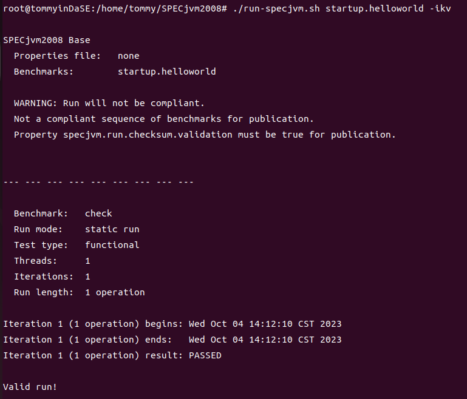

## 软件系统优化 A2

### 10211900416 郭夏辉

## 访问 SPECjvm2008 官方网站，阅读 User’s Guide、Run and Report Rules、Known Issues、FAQ 四份文档，了解 SPEC 组织和一个标准的基准评测集的基本情况。

1. SPEC 组织的基本情况

**The Standard Performance Evaluation Corporation (SPEC)** is a non-profit corporation formed to establish, maintain and endorse standardized benchmarks and tools to evaluate performance and energy efficiency for the newest generation of computing systems. SPEC develops benchmark suites and also reviews and publishes submitted results from our [member organizations](https://www.spec.org/consortium/) and other benchmark licensees.

SPEC是一个非营利性组织，旨在建立、维护和认可用于评估最新一代计算系统性能和能源效率的标准化基准和工具。SPEC开发基准套件，同时还审核和发布来自我们的成员组织以及其他基准许可方提交的结果。

2. 一个标准的基准评测集的基本情况

在[SPECjvm2008的用户手册部分](https://www.spec.org/jvm2008/docs/UserGuide.html),我看到了关于基准评测集的基本情况，经过翻译和自己的整理，大概可以这样去阐述：

SPECjvm2008的主要目的是测量JRE（JVM和关联库）的性能。它还测量了在执行JRE的情况下操作系统和硬件的性能。它侧重于JRE执行单个应用程序的性能；它反映了硬件处理器和内存子系统的性能，但对文件I/O几乎没有依赖，也不包括远程网络I/O。（The main purpose of SPECjvm2008 is to measure the performance of a JRE (a JVM and associated libraries). It also measures the performance of the operating system and hardware in the context of executing the JRE. It focuses on the performance of the JRE executing a single application; it reflects the performance of the hardware processor and memory subsystem, but has minimal dependence on file I/O and includes no remote network I/O.）

SPECjvm2008的工作负载模拟了各种常见的通用应用程序计算。这些特征反映了该基准测试旨在测量在各种运行Java的客户端和服务器系统上的基本Java性能。（The SPECjvm2008 workload mimics a variety of common general purpose application computations. These characteristics reflect the goal that this benchmark be applicable to measuring basic Java performance on a wide variety of both client and server systems running Java.）

SPECjvm2008有两个运行类别，分别称为基准（Base）和峰值（Peak），还有一个额外的运行类别称为Lagom。要生成符合规范的结果，必须包含基准类别的运行，而峰值类别的运行是可选的。(There are two run categories in SPECjvm2008 called Base and Peak and there is also an additional run category called Lagom. In order to create a compliant result, a run in the Base category must be included. It is optional to also include a run in the Peak category.)

每次调用基准测试工作负载都是一个操作。测试工具会多次调用基准测试，使其在一个迭代中执行多个操作。(Each invocation of a benchmark workload is one operation. The harness will call a benchmark several times, making it perform multiple operations in one iteration.)

迭代持续一段时间，默认为240秒。在此期间，测试工具将启动多个操作，一个新的操作在前一个操作完成后立即启动。它永远不会中止操作，而是等待操作完成后才停止。测试工具期望在一个迭代内至少完成5个操作。迭代的持续时间不会少于指定的时间，但根据热身期内的性能，如果操作时间过长，将会增加迭代的时间。(An iteration goes on for a certain duration, by default 240 seconds. During this time the harness will kick off several operations, one new one as soon as previous operation completed. It will never abort an operation, but wait until an operation is completed for stopping. The harness expects to complete at least 5 operations inside an iteration. The duration for an iteration is never less than specified time, but will be increased if the operations takes too long, based on performance in the warmup period.)

第一个迭代是一个热身迭代，默认运行120秒。热身迭代的结果不包括在基准测试结果中。要跳过热身迭代，将热身时间设置为0。(The first iteration is a warmup iteration, run for 120 seconds by default. The result of the warmup iteration is not included in the benchmark result. To skip warmup, set the warmup time to 0.)

## 下载和安装 SPECjvm2008，根据上述文档的指引， 跑一次完整的基准测试（大约 2~3小时），记录安装和测试的过程和结果 ，了解一个标准的基准测试集的基本执行过程。

### 1 配置Java环境

我沿着实验文档，去安装OpenJDK 1.8.0_41 RI Binaries。首先进入https://jdk.java.net/java-se-ri/8-MR3。

然后去下载那个Oracle Linux 7.6 x64 Java Development Kit。下载完成之后我把那个压缩包解压并安装：


解压之后，为了对所有的用户生效，我去/etc/profile中修改环境变量（注意这里打开这个文件要sudo）：


但是在检验老版本java是否正常安装时却出现了这样的问题：


发现还是新版本的java。可能是由于自己在上次实验时安装的java是通过apt-get的方式安装的，其中有很多未知的依赖关系，在调试了许久环境变量无果之后，无奈我只好把新版本（11版本）的jdk给卸载了：

```
sudo apt-get purge jdk*
sudo apt-get purge icedtea-* jdk-*
dpkg --list | grep -i jdk
```

在卸载之后，`source /etc/profile`,就正常了：


这里有一个很有意思的现象，就是我在source命令之后，原本的绿色高亮失去了。在网上查阅了一些资料之后我得知，这样的情况是因为我那个环境变量只在一个终端中有效，切换一个用户之后就没了，我试了一下果真如此：


这个的解决方法就是重启系统，重启之后，一切正常了。


### 2 安装 SPECjvm2008

首先要在官网（https://spec.cs.miami.edu/downloads/osg/java/SPECjvm2008_1_01_setup.jar）下载那个jar包。下载完成之后安装：

` java -jar SPECjvm2008_1_01_setup.jar -i console`

之后就沿着安装程序一路enter安装即可：


然后我来测试一下是否真的安装成功.进入/home/tommy/SPECjvm2008,`./run-specjvm.sh startup.helloworld -ikv`

startup.helloworld 是用来测试helloworld程序的启动时间，是一个很初级的测试。

为了进一步节省时间，我用-ikv参数跳过了签名验证。




可以看到程序的运行是正常的。

接下来就是这个实验最耗时的部分：跑一次完整的基准测试。

还是在SPECjvm2008的安装目录，选择base级别进行测试:

`java -jar SPECjvm2008.jar --base`


本来我都准备去做自己的其他事情去了，但是看着屏幕上的光标卡住不动了，意识到这里出了一些问题：


看起来这个startup.compiler.sunflow测试时出了些问题。然后我就去官方的FAQ文档（https://www.spec.org/jvm2008/docs/FAQ.html）查阅了一波，探索了一下之后看到了发生问题的原因：


我的jdk版本是1.8，所属Java SE 8.0,属于会出现问题的版本。

问题的解决方案就只是跳过这些基准，当然这也是解决这个问题最直接的思路咯。

最直接的思路便是干脆把那个名为startup.compiler.sunflow的benchmark给删除了。通过网上的教程，我这么干需要去修改配置文件（位于SPECjvm2008安装目录下的props/specjvm.properties），还要./run-specjvm.sh -base -pf props/specjvm.properties重新配置。但这样就违反了实验文档中要求的“无需修改 properties”，因此这个直接的思路我就放弃了

我还是想要来看一下具体的问题出在哪里。这个startup.compiler.sunflow的代码存放在哪里呢？在安装目录下的src/spec/benchmarks有各基准的代码文件，只用找到compiler目录下的sunflow目录就行。

在上网查阅了一些资料后，我看到了相关的问题解释[^1]  [^2] 及解决方案[^3].

原来，这个卡住的原因简要来说是这样的：

父进程启动子进程进行编译，然后父进程重定向了子进程的stderr，但是没有读取子进程的stderr，并使用futex等待子进程结束；与此同时，子进程在编译过程中产生了大量的警告信息，通过stderr输出；由于父进程没有读取子进程的stderr，因此子进程的stderr管道被写满以后，无法继续运行，被堵塞在write系统调用处。最终，子进程被堵塞了，父进程也无法等到子进程的结束，陷入了死锁境地。

具体的验证流程在我搜集到的资料中有很详细的解释，但是自己对于Linux的管道机制等内容并不算特别熟悉，此处并没有展开。

我尽量来具体地看看这个问题吧：

此时基准测试已经在startup.compiler.sunflow卡死了，然后我另外开了一个shell窗口：


看到Sl+(进程休眠)和S+(进程陷入了内核态但没有返回)。出问题的进程是4059，原进程是3986，理论上应该在工作的进程是4010.

我们来看一下这个4010到底唤起了什么系统调用，无法正常回来了：


是202号系统调用（#define __NR_futex 202）（来自系统调用表：/usr/include/asm/unistd.h）。futex是一个等待共享锁释放的系统调用。以上初步证明了出现卡死现象的原因来自futex系统调用和锁的释放问题。

根据前人的分析和经验，我可以startup.compiler.sunflow的源代码添加-nowarn选项，这样javac就不会输出警告信息了，自然也就不存在相应的阻塞问题：


接下来在SPECjvm2008的安装目录解压build-tools.zip(unzip build-tools.zip),利用解压出来的build-specjvm.sh重新编译SPECjvm2008(bash ./build-specjvm.sh)


然后再进入SPECjvm2008的安装目录的build/release/SPECjvm2008下运行 `java -jar SPECjvm2008.jar --base`进行基准测试就发现一切正常了。


当然最后我还看到了一个思路，我觉得这个有点杀鸡用牛刀了——修改内核代码，让管道变大一些。毕竟我们的需求只是让管道尺寸大一些，别卡死了，这么做还要重新编译内核，没必要如此大动干戈。如果实际一些，我完全可以使用`ulimit -p 65535`(将管道缓冲区扩大到65535kb)。在具体的测试中，我碰到了这样的问题，即便解决了ulimit的问题[^4]，但是基准测试依旧被卡死了，不知道为什么。

等了两个多小时，终于生成了基准测试的结果：


然后我上官网与过去的官方发布的结果（https://www.spec.org/jvm2008/results/jvm2008.html）对比一波。

在众多的结果中，我选择的是这条官方发布的结果：


我的jvm版本是OpenJDK 64-Bit Server VM (build 25.40-b25, mixed mode)。本着版本相近的原则，我才这样去选择了官方的那条结果。


那个官方的结果：（https://www.spec.org/jvm2008/results/res2015q1/jvm2008-20150120-00018.base/SPECjvm2008.base.html）


然后在对比差异环节，我想来浅谈几个差异的地方：

1. 我的报告右上方是一个大大的“Run is valid, but not compliant”，但是官方的确是“Run is compliant”。上网查了一下，这样的原因是因为毕竟我对相关的源代码进行了修改，因此即便运行是有效的，但是也不合乎他们官方的要求。
2. 虽然我和官方的报告相比各个benchmark的吞吐量都要小不少，但是benchmark排序之后具有较为明显的一致性。比如说，在各个benchmark中，startup吞吐量是最小的，但是xml却是最大的，其他也较为接近这个规律。整体上来说，我和官方的差距应该主要是来自于硬件。
3. 我的报告有很多很多的缺失信息（n/a）,sw-info,hw-info全部缺失。但是我和官方的报告对于各个benchmarks的测试，比如compiler.compiler，compiler.sunflow，却都有。

## 谈谈自己运行一次标准的基准评测的感想和体会。

在这次基准评测中，虽然整体上来说花了不少的时间，并且在此过程之中碰到的基准卡死问题，但是我最终完成了一次基准测试，见识到了测试的具体结果。在与官方的结果对比后，我不禁感叹个人电脑和那个2014年的服务器的差距（就是我选择的那个官方结果），并在数值的差距中看到了分布上的相似性。看来，对于相同的程序而言，可能在不同的机器上运行时间是有差距的；但是一系列程序所组成的基准测试集，所呈现出来的分布上的规律也是十分明显的。通过此，可以较好地对比各架构不一、优化各异的硬件之性能。

在这个实验中，查阅官方文档和手册乃至网上的经验起到了十分重要的作用，这对我日后学习相关的知识、完成各个实验任务必将不可缺少。诸如版本这样的问题就能让整个程序卡死，微不足道的细节问题造就了我们碰到的一个又一个bug.

## 参考及引用

[^1]: SPECjvm2008中startup.compiler.sunflow测试的假死问题分析:https://zhuanlan.zhihu.com/p/258483799

[^2]: specjvm2008堵塞调试:https://www.jianshu.com/p/9924b206bdfe

[^3]: **SPECjvm2008测试过程出现startup.compiler.sunflow堵塞一直卡住问题解决方法**:https://bbs.huaweicloud.com/forum/thread-174642-1-1.html 

[^4]: ubuntu读取文件限制——bash: ulimit: open files: cannot modify limit报错解决（修改 ulimit -n）https://blog.csdn.net/ng323/article/details/106140179https://blog.csdn.net/ng323/article/details/106140179
