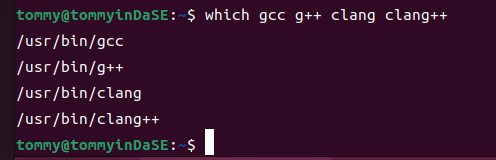

## 软件系统优化 A3

10211900416 郭夏辉

## 正式实验之前：版本检查

确保gcc,g++,clang在可执行文件的搜索路径上：

检查版本：

可以看到，gcc和g++的版本均为11.4.0，clang和clang++的版本均为14.0.0，都符合实验的要求。

## Write-up 1：请解释一下为什么 clang --version 与 clang++ --version 的输出结果是一样的

在刚刚的版本检查阶段，我们可以看到gcc --version 与 g++ --version 的输出结果不一样，但是clang --version 与 clang++ --version 的输出结果是一样的。要解释两者的输出为什么相同，这还要回归它们可执行文件具体位置（它们都在/usr/bin/目录下）。先进入/usr/bin/目录，因为此处有一大堆其他的命令，我们只需筛选出clang命令即可：

可以看到,clang软连接到/usr/lib/llvm-14/bin/clang，clang++软连接到/usr/lib/llvm-14/bin/clang++。然后我再进入/usr/lib/llvm-14/bin/ 目录下面进行类似的操作：

可以发现，/usr/lib/llvm-14/bin/clang++又软连接到了/usr/lib/llvm-14/bin/clang

综上所述，在clang --version和clang++ --version时，本质来说都是在执行/usr/lib/llvm-14/bin/clang --version ，因此最终的输出完全一样。

## Write-up 2：请说明一下你选择了哪个测试例，以及你选择这个测试例的原因。 

来自chriscox的测试工具之下载、解压此处就略过了，我进入其目录，看到了很多测试文件，它们每个都对应了一个测试的项目。在各项目的cpp文件下，通过注释我可以大概明白这个项目的内容。

在理论课中，老师介绍过一些源程序级别的常见优化方法，这其中我们看到为了优化程序工作量各个角度的优化措施。此时我面对各个方面的测试例都有些选择困难症了，但是考虑到自己的选择要尽可能地综合反映编译器对程序的影响，还要尽力去展现优化，选的便是循环这一常见的大方向。

在循环层次，消除无用迭代的思想是修改循环的边界条件以避免执行那些实际上循环体为空的循环迭代。究其本质，还是对循环的归纳变量（induction variables，比如说`for(int i=0;i<100;i++){}`中的 **i** ）进行优化。在日常的coding过程中，我们利用好这些变量确实可以减少冗余、循环迭代，进而提升程序的效率。因此，在众多测试例中，我最终选择了**loop_induction.cpp**，它能测试编译器对删除未使用的归纳变量、识别具有线性关系的归纳变量等方面的优化。

（其实也有一些自己感兴趣的其他测试例，实验时就没有去测试了，有点小遗憾）

## Write-up 3：你对 makefile 及所选测试例对应的源文件做了哪些修改，为什么？ 

首先我要对makefile文件进行些改动。因为我只使用一个测视例，所以其他的都给注释掉了（BINARIES和report选项）：

(注意report最后的几句话没有注释)

在注释完成之后，我去看其他的makefile选项，这里CC指的是采用的默认的C语言编译器；CXX指的是采用的默认的C++编译器。同时，我也看到这里的设置会使得每次编译都采用O3选项，要进行一些修改：

我怎么修改呢？我期望在命令行中以命令的方式输入希望的选项，所以最后是这样修改的：

修改完了makefile,我也要对源代码进行一些修改。默认情况loop_induction.cpp的循环迭代次数是600000，十分大，跑一个情况就要很久，我选择将其削减到100000次以减少测试时间：

## Write-up 4：请针对选定的测试例及收集到的 6 个测试数据结果文件（以及相应测试例编译后的代码大小），进行数据分析，总结分析洞见。

>要求：
>
>1. 需要对不同组合下测试例的代码大小及运行性能进行分析 
>2. 尽量用可视化的形式来呈现分析结果 
>3. 分析洞见的总结尽量简明扼要，如有可能请加上对所总结洞见的合理解释

经历了上述的修改，接下来就是测试阶段了。这里有一个需要注意的事就是每个情况在make之前要make clean清除上次遗留下来的相关文件。

### 4.1 可执行文件大小的比较

首先，最直观的数据便是6次测试中测试例编译后的代码大小，如下表所示:

1. 两种编译器在O0时得到的文件大小都较大，但O1时的文件大小都是最小的；
2. 从O1到O2体积却有所增大，clang++生成的O2可执行文件大小体积比O0时还要大不少；
3. 除了O2，其他选项时两种编译器生成的文件体积不存在显著性的差异；

**在接下来的内容开始之前，我想说程序运行时间的主体是归纳变量复制这一操作，因此通过它的复制时间能来衡量可执行文件的运行效率。测试结果包含for,while,do,goto循环的归纳变量复制时间，但是它们的复制过程在相同编译器、相同优化等级时还是类似的（在结果文件中比较可得，这四种结构经过相同的迭代运行的时间并没有显著差异），然后为了利用report提供的其他数据，我抽取出for来论述。**

### 4.2 循环中归纳变量复制的总时间

在测试report中有很多指标，我首先选择的指标是"Total absolute time for for loop induction copy",即for循环中归纳变量复制的总绝对时间，这个是总体性的指标，也能反映优化的程度，肯定是越小效果越好：

1. O0不做任何优化时，两种类型编译器下循环的运行时间都很长，但是g++更胜一筹
2. O0到O1有明显的提升，O1到O2提升就不算很明显了

### 4.3 未使用的归纳变量复制的总时间

接下来，由于归纳变量在循环体中往往不被使用，所以我选取的是"Total absolute time for for loop unused induction copy",即for循环中**未使用**的归纳变量复制的总绝对时间，这个能反映一些编译器对循环变量的优化，这个指标越小体现了优化效果越好：

1. 在O0不做任何优化时，两种编译器生成的可执行文件在未使用的归纳变量复制上花费了很多时间，很多时间都在做无用功；
2. O0到O1这一现象有明显的改善，两种编译器差别不是很大；从O1到O2,g++没有什么提升，但是clang++却还有一点提升。

### 4.4 for循环中归纳变量复制的有效率

然后我就想到了一个问题，我刚刚不是得到了"for循环中未使用的归纳变量复制的总绝对时间"吗？我现在还有"for循环中归纳变量复制的总绝对时间"，那么我是不是可以得到"for循环中归纳变量复制的有效率"这个新指标？这个有效率越高，说明程序更高比例的时间是在复制使用的归纳变量，优化的效果越好：

O0情况时两者的有效复制率都很低；从O0到O1两者的有效率都有显著提升；从O1到O2 g++效果不增反减，clang++却有明显的进步。

### 4.5 总结

综合上面的各种比较，我来总结一下自己的实验：

1. 即便优化的选项相同，O2选项时g++对于clang++更倾向于减少可执行文件的体积；同时也并非优化程度越高代码的体积越小——虽然从O0到O1确实明显地减少了文件体积，但是O1到O2时文件体积不减反增。推测在此可能存在“以空间换时间”的策略
2. O0时两种编译器各个指标基本相近
3. O1和O2情况下clang++的整体优化效果都比g++好。从O1到O2 clang++显著提升，但是g++并不明显。可以猜测两种编译器优化的具体路径还是存在差异的，其中clang++从O1到O2时可能大幅地提升了归纳变量的复制有效性，进而提升循环运行的效率。从O0到O1无论从哪个程度来说两种编译器的优化效果都最明显，根据复制有效率的激增推测编译器此时都有提升复制有效性这一工作。
4. 整体来说，此测试例中clang++优化的效果比g++要优秀
