## 软件系统优化 A4

10211900416 郭夏辉

## Write-up 1

**请同学们对照着 example1.c 仔细理解上一命令的输出文件example1.s，画出汇编代码的控制流图。同时比较一下你得到的 example1.s 跟下图中另一版本的编译器生成的 example1.s 有什么区别。详细说明你得到的 example1.s 中.LBB0_2 内向量化后代码的循环控制逻辑跟下图中.LBB0_2 内向量化后代码的循环控制逻辑有何不同，阐述你对这两种代码生成方法各自优缺点的理解。(请同学们注明一下自己实验环境下的clang 版本)**

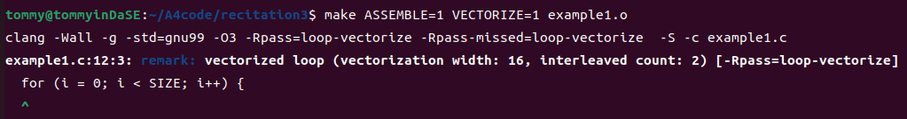

在运行了指定的命令之后，编译器提示我们编译过程中进行了循环向量化。接着我们打开产出的汇编文件example1.s,然后画出控制流图。在画图的过程中，我注意到很多要与一个数字65536进行比较，比如这里：

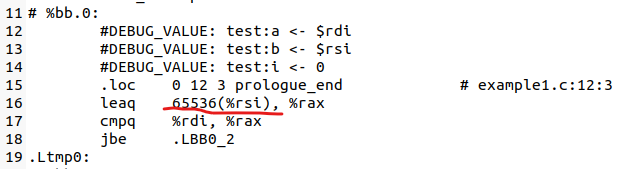

其实这个数字便是example1.c中的宏定义SIZE（2^16=65536）：

然后在汇编代码中，有很多诸如这样的语句，它们其实是example1.c中那个循环运行的具体流程（第13行的代码），我在绘画CFG时其实并不用关心它，因为这里的循环体对于循环的约束并没有什么影响：

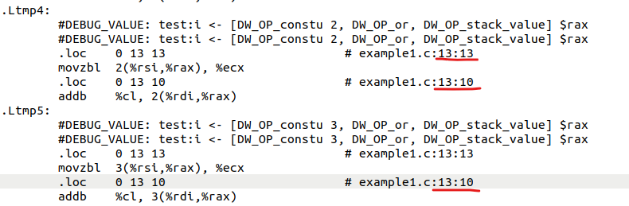

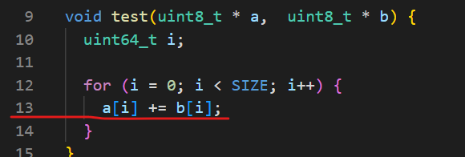

在实际运用过程中我们一般使用寄存器%rax来存临时变量，结合example1.c中循环条件的比较（i<SIZE）,我推测这其中利用那个%rax来存归纳变量 i  

基于如上的思路，回忆去年在计算机系统所学的知识，我利用https://app.diagrams.net 画出了CFG如下所示：

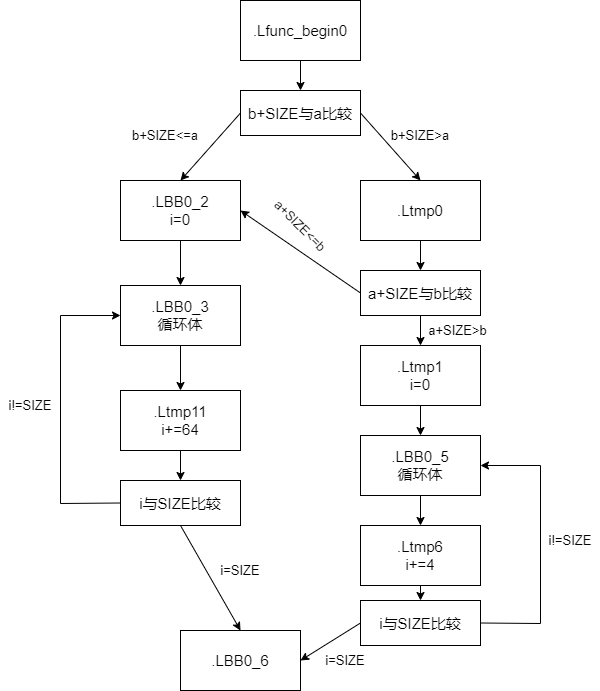

我的clang版本是14.0.0：

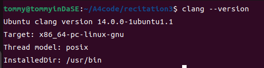

在画出CFG之后，函数的逻辑就很清楚了。如果b+SIZE不超过a,说明b数组的所有元素在内存中存于a数组之前，两个数组不存在重叠元素；如果b+SIZE大于a，并且a+SIZE不超过b,说明a数组的所有元素在内存中存于b数组之前，两个数组不存在重叠元素；其他情况下两个数组存在重叠元素，不能进行向量化优化。

 uint8_t的大小是1字节。如果能进行向量化，每轮循环i+=64,这意味着可以进行64字节的运算；如果不能，每轮循环i+=4,这意味着只能进行4字节的运算。从循环的次数来看，前者对于后者的减少程度是显著的，应该会对性能产生较为显著的影响。

**然后我详细地对比了一下自己的汇编代码和实验文档给出的汇编代码之区别。**

1. **循环的初始化方式不同。**

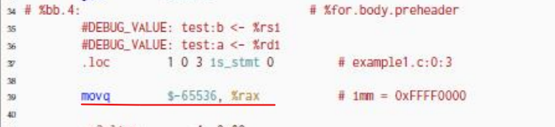

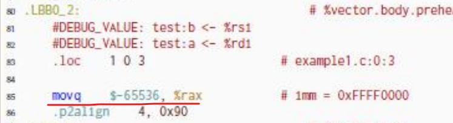

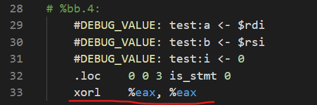

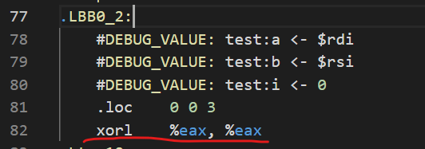

我的汇编代码是将初始值取为0，实验文档版本的是取-65536

2. **循环结束的方式不同。**

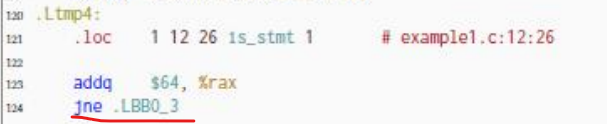

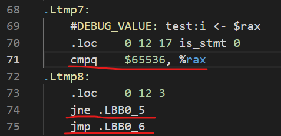

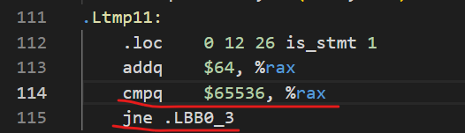

我的汇编代码是将i与65536比较，实验文档版本由于add指令会修改状态位，所以隐含着将i与0比较的过程。

3. **循环体过程存在差异。**

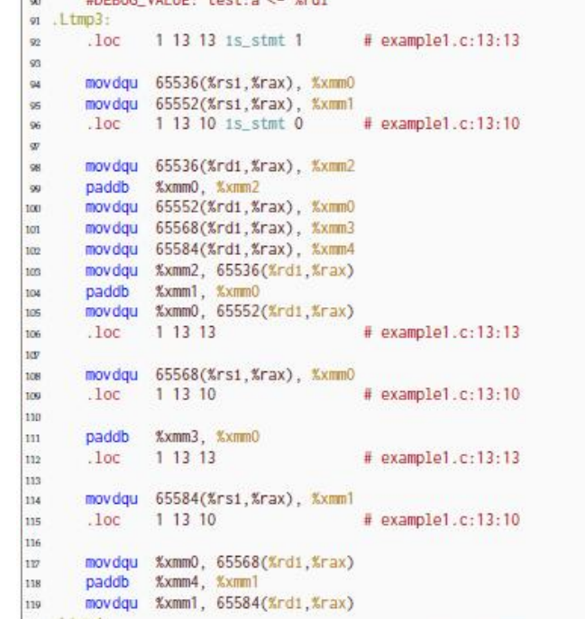

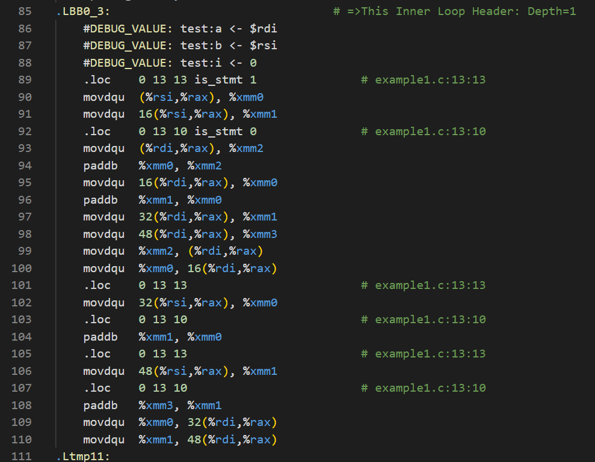

如果满足条件，则能进行循环向量化，但是我们还是可以看到循环体的内容是存在差异的。虽然整体的逻辑类似（比如观察可得我的版本中的`  movdqu  (%rsi,%rax), %xmm0`和`  movdqu  16(%rsi,%rax), %xmm1`分别对应实验文档版本的`movdqu 65536(%rsi,%rax), %xmm0`和`movdqu 65552(%rsi,%rax), %xmm1`,毕竟65552-65536=16），但是因为之前提到的源自初始化的差异，所以对内存的访问存在差异。

其实在逻辑上，我的版本的汇编代码中向量化语句和实验文档版本的几乎一一对应，并没有什么大的差异。真正的差异还是如我以上所述，在于取值和偏移量。我着重来**谈一下两种代码生成方法各自的优缺点**。

从我的个人感受来说，实验文档给出的汇编代码是很tricky的，因为利用好了状态码，所以每次都不用像我的版本那样去和cmp一下（其实cmp隐含着一次减法，更改了状态码之后，还要决定再jne跳转，这又有一次比较操作），这样实验文档的版本就减少了SIZE次的作差工作，这对性能的提升还是较为显著的（尤其是在循环次数更大时）。如果要像实验文档中那样进行一个偏移了SIZE的运算（比如从0偏移至65536，从16偏移到65552），这无形中增加了一些编译器的压力，我的版本之汇编代码兴许在编译上所花时间更短（当然这只是猜想，此处无法证明）。

## Write-up 2

**请同学们仔细理解这个命令所产生的新的输出文件 example1.s 与Write-up1中所分析的 example1.s 有何区别，简单阐述为何会有这个区别。**

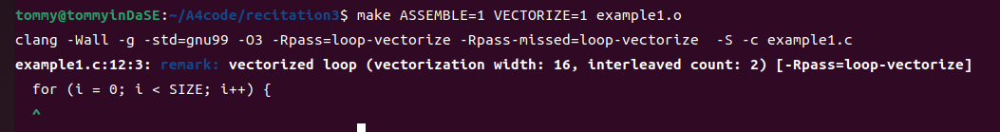

从长度来说，我能明显感受到新文件比老文件要短。新文件从.Lfunc_begin0进入之后，压根就没有之前的比较b+SIZE和a大小与比较a+SIZE和b大小这两个过程，每次循环迭代都会i+=64（说明进行了向量化，即不用判断情况是否符合了，现在直接都进行向量化了）。

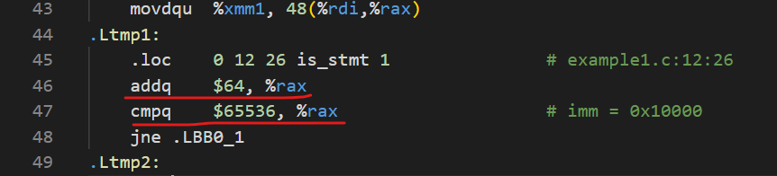

使用restrict关键字看来对当下的情况产生了影响，此时循环一定进行向量化而不必每次判断能不能进行后再去执行对应的代码。在查阅了网络上的资料后，我了解到这个关键词`用于指示编译器某些指针在特定情况下是唯一访问特定内存区域的，没有别名。`，这样编译器就不会认为存在数组元素重叠的可能了，自然而然也就不会生成不满足向量化条件的汇编代码了。

## Write-up 3

**请同学们仔细理解这个命令所产生的新的输出文件 example1.s 与Write-up2中所分析的 example1.s 有何区别，简单阐述为何会有这个区别。**

乍看一下，这个和Write-up2中的汇编代码还挺相似：

Write-up2中的代码：

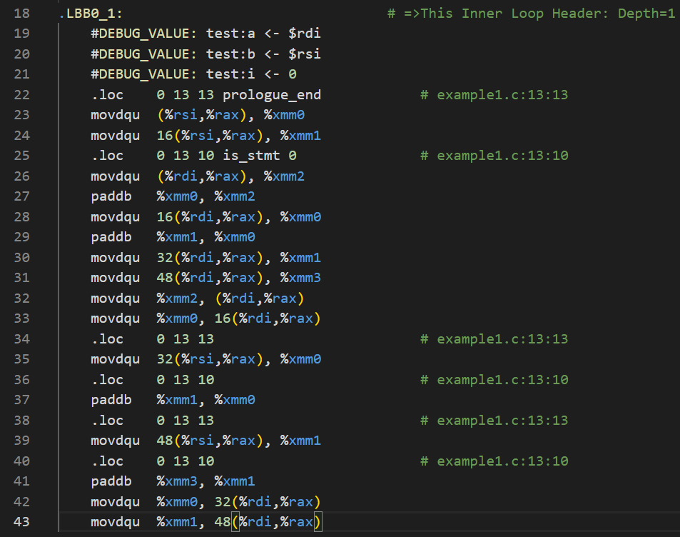

新的汇编代码：

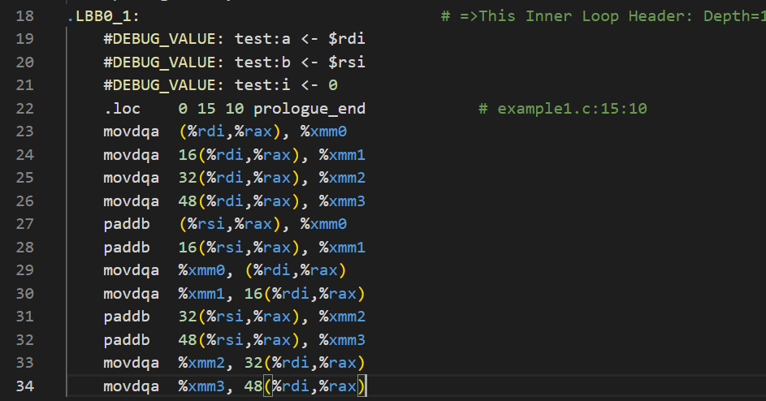

首先能感觉到新的汇编代码更短了。细细比较能看到旧的代码mov指令的最后一位是u，新的却是a。回忆一下CSAPP的知识，这意味着执行mov指令的对象是不同的，前者是非对齐的双四字，后者是对其的双四字。[^1] [^2] 两个指令都是用于把 128 位数据传送到 XMM 寄存器中，只不过一种是针对对齐情况的，另一种是针对非对齐情况的。

那么为什么加上`__builtin_assume_aligned`指令之后程序就多默认元素是对齐了呢？这样做有什么意义？

在网上我查阅到了这样的解释，此处引用一下. [^3]

>1. 在近10年的Intel CPU 上对齐和非对齐的SIMD访寸指令（比如movdqa和movdqu）没有任何性能差异，非对齐访存慢是因为跨越cache line 造成了cache line split，和指令没有关系；
>2. VEX编码的SSE指令和更新的AVX/AVX-512指令除了那几条明确的对齐指令外都已经没有对其限制（既不会在非对其时抛硬件异常）。比如movdqa是明确的对齐指令，而内存操作数的addps没有明确要求，它在SSE编码下要求对齐，在VEX编码下不要求对齐。

看来，非对齐和对齐的指令在现代CPU上并没有什么性能上的差异。那为何要使用对齐呢？我苦苦思索也想不明白为什么，所以又去对比了一下这里的汇编代码和writeup-2中的差异。

还记得吗？**我觉得两者的乍看挺相似的，但是长度似乎短了一些。**从这里入手，新的代码到底短在了哪里？就拿进入循环体.LBB0_1的操作为例（具体的代码上面有截图示范），对比可以看到，由于paddb指令要求操作变量是内存对齐的，所以旧代码花了许多额外的功夫来进行对齐操作后才能paddb；新的代码直接拿寄存器中的值与内存中的值进行一个paddb操作，节省了许多时间上的开销。

`__builtin_assume_aligned`指令让编译器假定数组已经是内存对齐的，这样就可以使用movdqa了。在有这样的承诺之后，编译器便不会担心可能存在的异常情况，可以激进些地执行工作，减少无效命令数量的同时提高了运行上的时间成本。

## Write-up 4

**请同学们仔细理解这个命令所产生的新的输出文件 example1.s 与Write-up3中所分析的 example1.s 有何区别，简单阐述为何会有这个区别。为使编译器生成对齐内存访问的 AVX2 指令，应该对 example1.c 再做何修改？请附上修改后的代码。**

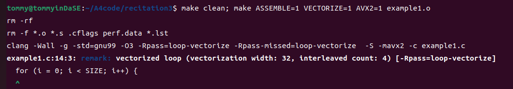

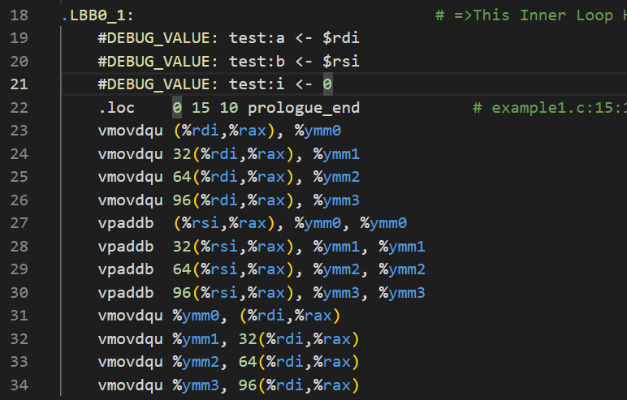

最直观的差异还是新代码从Write-up3中的movdqa，paddb变成了vmovdqu，vpaddb. 本来声明对齐的现在又被声明为了非对齐，而且前面还加了个v表示向量化。寄存器也由原本的xmm换成了AVX2寄存器ymm。

至于为什么会产生这样的差异，显然是因为我们生成了AVX2 代码所致。AVX是一种拓展的指令集，这个指令集下寄存器有32字节的长度，但是我们刚刚声明的对齐还是16字节对齐呢，新的情况下不对齐了，自然而然dqa就变成了dqu。至于如何恢复对齐其实也显而易见——我们修改一下`__builtin_assume_aligned`中的声明，将其修正为32字节的就行：

```c
  a = __builtin_assume_aligned(a,32);
  b = __builtin_assume_aligned(b,32);
```

修改了之后再编译就恢复了：

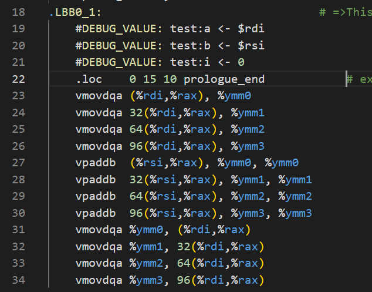

## Write-up 5

**请认真比较 example2.s 和 example2.s.ORG，尝试解释一下为什么新的example2.s 含有比较高效的向量化代码。**

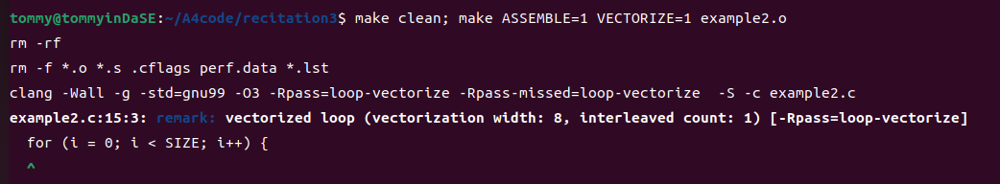

我首先还是来对比一下这两个汇编代码。虽然它们的效果是等价的，但是我生成的example2.s.ORG有532行而example2.s仅有359行，使用三目运算符之后长度上来说明显下滑了。

在example2.s.ORG中，从循环的主体从.LBB0_1开始看起，我了解到它进行了很多次两数组对应元素的比较工作，更崩溃的是pxor和shr，psllq（批量左移操作）pextrw（从 XMM 寄存器中提取一个 16 位的字并将其存储到一个通用寄存器或者内存中）等位运算把比较的结果放到了xmm寄存器中，这就意味着要想做出正确的选择，还要再做一大堆位运算把那个结果给提取出来！

```assembly
.LBB0_1:                                # =>This Inner Loop Header: Depth=1
	#DEBUG_VALUE: test:a <- $rdi
	#DEBUG_VALUE: test:b <- $rsi
	#DEBUG_VALUE: test:x <- $rdi
	#DEBUG_VALUE: test:y <- $rsi
	#DEBUG_VALUE: test:i <- 0
	.loc	0 17 9                          # example2.c:17:9
	movq	(%rsi,%rax), %xmm1              # xmm1 = mem[0],zero
	.loc	0 17 16 is_stmt 0               # example2.c:17:16
	movq	(%rdi,%rax), %xmm3              # xmm3 = mem[0],zero
	.loc	0 17 14                         # example2.c:17:14
	pminub	%xmm1, %xmm3
	pcmpeqb	%xmm1, %xmm3
	movd	%xmm3, %ecx
	notb	%cl
.Ltmp3:
	.loc	0 15 26 is_stmt 1               # example2.c:15:26
	testb	$1, %cl
	je	.LBB0_3
.Ltmp4:
# %bb.2:                                #   in Loop: Header=BB0_1 Depth=1
	#DEBUG_VALUE: test:a <- $rdi
	#DEBUG_VALUE: test:b <- $rsi
	#DEBUG_VALUE: test:x <- $rdi
	#DEBUG_VALUE: test:y <- $rsi
	#DEBUG_VALUE: test:i <- 0
	.loc	0 17 14                         # example2.c:17:14
	movd	%xmm1, %ecx
	movb	%cl, (%rdi,%rax)
```

`pminub` 指令执行XMM1和XMM3寄存器中对应字节的无符号字节最小值操作，结果存储在 XMM3 寄存器中。这意味着XMM3中的每个字节都包含XMM1和XMM3中对应字节的最小值。`pcmpeqb` 指令执行XMM1和XMM3寄存器中对应字节的比较相等操作，结果存储在 XMM3 寄存器中。这意味着XMM3中的每个字节将被设置为全1，如果XMM1和XMM3中对应字节相等，否则为0。`notb` 指令对 `%ecx` 寄存器的低8位执行按位非操作。这意味着 `%ecx` 中的每个位都被取反（0变成1，1变成0）。

与之相对比，example2.s的逻辑就很简洁。从它的.LBB0_1看，就只有短短几行：

```assembly
.LBB0_1:                                # =>This Inner Loop Header: Depth=1
	#DEBUG_VALUE: test:a <- $rdi
	#DEBUG_VALUE: test:b <- $rsi
	#DEBUG_VALUE: test:x <- $rdi
	#DEBUG_VALUE: test:y <- $rsi
	#DEBUG_VALUE: test:i <- 0
	.loc	0 17 13 prologue_end            # example2.c:17:13
	movdqa	(%rsi,%rax), %xmm0
	movdqa	16(%rsi,%rax), %xmm1
	.loc	0 17 12 is_stmt 0               # example2.c:17:12
	pmaxub	(%rdi,%rax), %xmm0
	pmaxub	16(%rdi,%rax), %xmm1
	.loc	0 17 10                         # example2.c:17:10
	movdqa	%xmm0, (%rdi,%rax)
	movdqa	%xmm1, 16(%rdi,%rax)
	.loc	0 17 13                         # example2.c:17:13
	movdqa	32(%rsi,%rax), %xmm0
	movdqa	48(%rsi,%rax), %xmm1
	.loc	0 17 12                         # example2.c:17:12
	pmaxub	32(%rdi,%rax), %xmm0
	pmaxub	48(%rdi,%rax), %xmm1
	.loc	0 17 10                         # example2.c:17:10
	movdqa	%xmm0, 32(%rdi,%rax)
	movdqa	%xmm1, 48(%rdi,%rax)
.Ltmp1:
	.loc	0 15 26 is_stmt 1               # example2.c:15:26
	addq	$64, %rax
	cmpq	$65536, %rax                    # imm = 0x10000
	jne	.LBB0_1
```

可以看到，新的代码出现了原来没有的pmaxub指令，它用于执行 packed maximum（打包最大值） 无符号字节操作。该指令对两个 XMM 寄存器中对应位置的字节进行比较，并将每个位置上的最大值存储到目标寄存器中。这一个操作，可以视作是example2.s.ORG中繁冗工作的一个打包，因此汇编代码的长度明显地下降了，逻辑上也更加精简了。

然后我要来解释一下为何example2.s比example2.s.ORG更高效。首先从向量化的角度前者绝对是比后者要成功不少——example2.s.ORG的.LBB0_17中	addq	$8, %rax意味着每次归纳变量只能前进8；但是example2.s的.Ltmp1中`  addq   $64, %rax`每次归纳变量能前进64。

其次，我觉得在步长受限的情况下，example2.s.ORG把一堆比较的结果放到了寄存器xmm中，这样做使得汇编代码可读性极差不说，还在未来要使用这些信息时想要再提取出来就还要经过一堆冗长的操作，这无形中大大增加了无效运算的数量。

最后，引起这个优化的原因并不是我们像之前的write-up中那样开了什么选项，而只是将if-else语句转化为了三目运算符。我觉得可能是因为三目运算符使得编译器更倾向于简化控制流的逻辑，在此基础上程序的向量化程度更高了，自然而然运行效率有所提升。但是，我在网上也并没有查到三目运算符就一定能带来向量化，进而导致效率提高的证明，所以我这个猜想还存疑。

## Write-up 6

**请认真理解 example3.s，尝试解释一下为什么 example3.s 中没有出现向量化指令。编译器对这个循环进行向量化优化是否可以生成更加高性能的代码？为什么？**

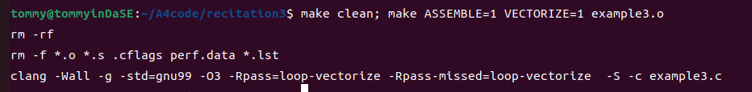

这个example3.c到底相对于我们之前的程序有什么不同呢？循环体内的东西是a[i] = b[i + 1]; 这意味着将b数组的一大部分偏移了之后放入a数组。循环的主体汇编代码是这样的：

```assembly
.Ltmp0:
	#DEBUG_VALUE: test:i <- 0
	.loc	0 12 3 prologue_end             # example3.c:12:3
	addq	$1, %rsi
.Ltmp1:
	#DEBUG_VALUE: test:b <- [DW_OP_LLVM_entry_value 1] $rsi
	.loc	0 13 10                         # example3.c:13:10
	movl	$65536, %edx                    # imm = 0x10000
	callq	memcpy@PLT
```

可以看到汇编代码直接调用memcpy(a,b+1,SIZE)，不再费力地进行各种向量化或者非向量化的机械操作了！至于这里为什么没有向量化了，我认为是由于前人写好的memcpy方法已经包含了很多优化的机制，在效率上已经达到了很高的程度，编译器判定向量化带来的性能提升并不如使用相应的库函数。

这里我不禁思考，我们日常使用的memcpy是如何工作的？为什么编译器直接判定使用memcpy会跟高效呢？我看了一个问题下大家的回答[^4] ，然后通过ClickHouse(一种OLAP形列式存储数据库，性能上十分好，包含了大量软件层面的优化)对memcpy的实现 [^5]，我看出了一些端倪。我们可以看到他们在较大的内存块memcpy时，使用SIMD指令集一次性处理128位数据。如此庞大的连续拷贝，相比较传统的向量化使用SIMD指令集一次仅能处理32/64位数据来说有很大性能上的进步。甚至我查到如果使用AVX2指令集来优化，一次性可以处理256位的数据。  

综上所述，我觉得编译器这么相信memcpy,主要是因为虽然memcpy和传统的向量化都使用了SIMD指令集，但是前者更为激进地采用了较大快的复制操作，对循环次数、循环判断的次数的减少效果更好了。即使这样的优化需要在块较大的情况下才能满足，但是内存块的复制瓶颈也在大小，耗时的memcpy发生于大块复制，所以小块时memcpy即便不优也不重要了。

如果说这份代码进行向量化是否可以生成更加高性能的代码，我觉得不会。结合上面的解释，我们可以看到内存块还是比较大的（65536字节），符合memcpy表现更优的情况。

## Write-up 7

**请比较 example4.s.ORG 和 example4.s 中跟 test 函数对应的汇编代码，解释这两个版本中汇编代码的差别，并解释导致这个差别的原因？**

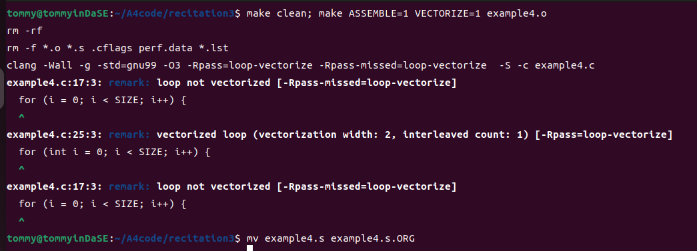

这里要比较的是两个文件中与 test 函数对应的汇编代码，所以比较汇编代码总长度显得不那么有说服力了。

在example4.s.ORG中，每次循环迭代操作大概是这样的：

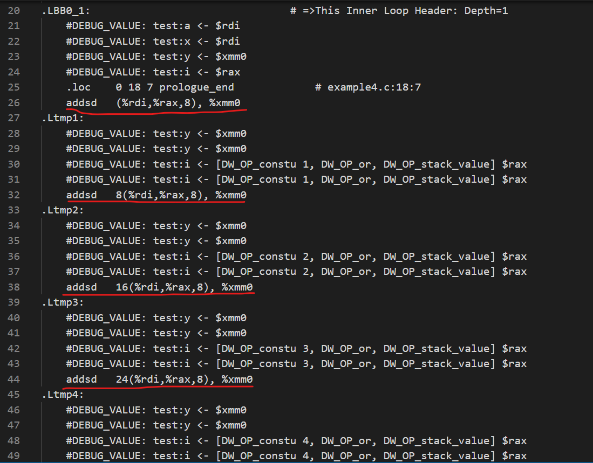

注意到addsd依次内存地址有8的偏移量，这在最后也有印证：

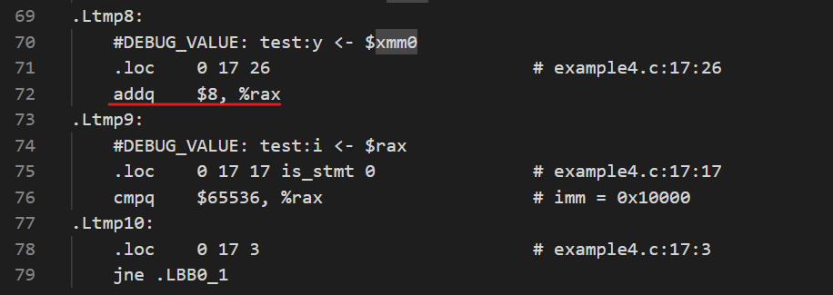

而在example4.s中，每次循环迭代操作大概是这样的：

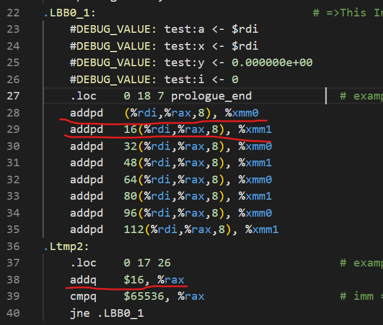

注意到这里使用的不是addsd而是addpd，并且以此内存地址有16的偏移量，而且还使用了一个额外的xmm寄存器xmm1.

在理论课程中，我们直到addsd和addpd针对的都是双精度浮点数，只不过前者用于单个标量而后者用于组装起来的向量。

example4.s.ORG没有采用向量化，严格地依照浮点数的运算顺序进行加法，每轮循环将8个x数组中的浮点数加到xmm0寄存器。

example4.s采用了向量化，通过调整浮点数运算的顺序，利用addpd打包两个浮点数的加法（一次性进行两次加法），并行交错地在xmm0和xmm1这两个寄存器中存取一部分和，最终再将这两个结果加起来，便能在每轮循环得到16个x数组中的浮点数之和。

产生这样的变化的原因在于编译时添加了-ffast-math选项，我查阅了一下关于这个选项的解释[^6]。这个选项告诉编译器不必关心严格的IEEE浮点数兼容性，允许对指令进行重新排序，使其在数学上相同（虽然在浮点数计算上并非完全相同）。这个改变加法顺序的行为使得编译器可以生成向量化的代码，理论上确实是完全可行的，但是在CSAPP中我们也学过了IEEE浮点数运算的舍入误差问题，所以实际上来说这样去做即便能提高性能也不那么严谨。

## Write-up 8

**设计一个实验方案，最后用图示化的形式科学地比较上述三种情况下生成代码的性能，并尝试去解释性能提升的原因。请注意实验结果的描述需要包含对你的实验平台的描述，而且性能提升的解释也需要结合你的实验平台特点。**

众所周知，向量化不仅需要编译器按照要求生成相应的汇编代码，而且还需要硬件支持这一操作，我先检查了一下自己的CPU情况。在cat /proc/cpuinfo之后，我看到自己的8核处理器 AMD Ryzen 7 4800H每个核心的flags都是这样的：

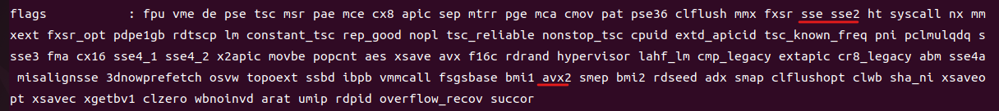

能看到sse和avx2，这说明我的机器是支持向量化的。

简单实验一下，发现并不是很能展现三种情况的差异：

```shell
tommy@tommyinDaSE:~/A4code/homework3$ make; time ./loop
clang -Wall -std=gnu99 -g -O3 -DNDEBUG -fno-vectorize -c loop.c
clang -o loop loop.o -lrt
Elapsed execution time: 0.036697 sec; N: 1024, I: 100000, __OP__: +, __TYPE__: uint32_t

real	0m0.038s
user	0m0.034s
sys	0m0.004s
tommy@tommyinDaSE:~/A4code/homework3$ make VECTORIZE=1; time ./loop
clang -Wall -std=gnu99 -g -O3 -DNDEBUG -Rpass=loop-vectorize -Rpass-missed=loop-vectorize -ffast-math -c loop.c
loop.c:70:9: remark: vectorized loop (vectorization width: 4, interleaved count: 2) [-Rpass=loop-vectorize]
        for (j = 0; j < N; j++) {
        ^
clang -o loop loop.o -lrt
Elapsed execution time: 0.009479 sec; N: 1024, I: 100000, __OP__: +, __TYPE__: uint32_t

real	0m0.011s
user	0m0.007s
sys	0m0.004s
tommy@tommyinDaSE:~/A4code/homework3$ make VECTORIZE=1 AVX2=1; time ./loop
clang -Wall -std=gnu99 -g -O3 -DNDEBUG -Rpass=loop-vectorize -Rpass-missed=loop-vectorize -ffast-math -mavx2 -c loop.c
loop.c:70:9: remark: vectorized loop (vectorization width: 8, interleaved count: 4) [-Rpass=loop-vectorize]
        for (j = 0; j < N; j++) {
        ^
clang -o loop loop.o -lrt
Elapsed execution time: 0.004626 sec; N: 1024, I: 100000, __OP__: +, __TYPE__: uint32_t

real	0m0.006s
user	0m0.006s
sys	0m0.000s

```

接下来就是我来设计实验对比一下不同情况下生成代码的性能。我的主要思路就是多次运行取平均运行时间，这个为了简化工作，我参考着实验文档中的语句写了个脚本test.sh。

```shell
make clean

make
mv loop loop1
make VECTORIZE=1
mv loop loop2
make VECTORIZE=1 AVX2=1
mv loop loop3


n=100
RESULTS="results.txt"
time1="0"
time2="0"
time3="0"

for i in $(seq 1 $n)
do
    exec="./loop1"
    tmp=$($exec | grep "sec" | grep -o "[0-9]*\.[0-9]*" )
    time1=$(echo "$tmp + $time1" | bc -l)
    echo "$i loop1 sumtime: $time1" >> $RESULTS
    
    exec="./loop2"
    tmp=$($exec | grep "sec" | grep -o "[0-9]*\.[0-9]*" )
    time2=$(echo "$tmp + $time2" | bc -l)
    echo "$i loop2 sumtime: $time2" >> $RESULTS
    
    exec="./loop3"
    tmp=$($exec | grep "sec" | grep -o "[0-9]*\.[0-9]*" )
    time3=$(echo "$tmp + $time3" | bc -l)
    echo "$i loop3 sumtime: $time3" >> $RESULTS
    
done

time1=$(echo "$time1 / $n" | bc -l)
time2=$(echo "$time2 / $n" | bc -l)
time3=$(echo "$time3 / $n" | bc -l)

echo "$time1"
echo "$time2"
echo "$time3"
```

重复进行100次后，我得到了三个版本的平均运行时间，它们分别对应原始性能、向量化后的性能和用AVX2指令优化后的性能：

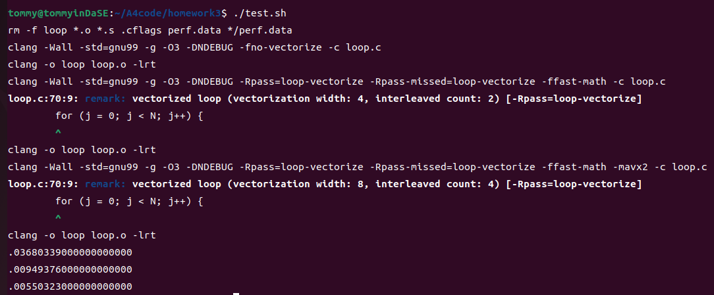

**分别为0.03680339，0.00949376，0.00550323**

可以发现运行时间上还是存在着不小的差异。

具体的测试运行时间数据存放在results.txt,为了让这个性能差异展现地更加直观，我做了个图：

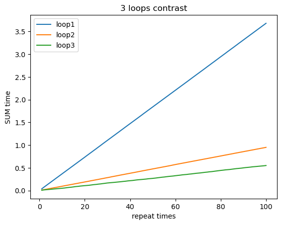

可以看到三个程序随着重复次数的增长，运行时间也很明显地近乎是线性增长，说明它们每次运行执行的工作差不多。

在此实验验证基础之上，从原始的到向量化后的再到AVX2指令优化后的代码，效率都有提升。打开它们三者的汇编代码，我也能看到明显的差异。此处我只以循环迭代的变化为例谈一下变化：

原始的：

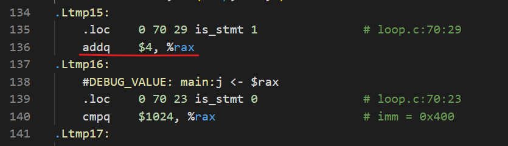

向量化后的：

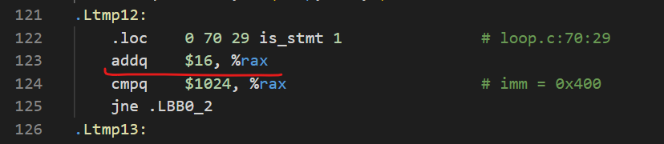

用 AVX2 指令优化后的：

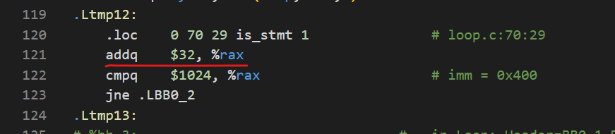

可以看到它们三者每次循环的步长存在差异，步长大小分别为4,16,32。难道这个比例也是它们运行时间的差异嘛？我尝试着做了个除法——$\frac{0.03680339}{0.00949376}=3.8766$,$\frac{0.00949376}{0.00550323}=1.72513$

我猜测没有完全对应是因为缓存大小的问题，这个结果算是和它们步长之间的比值很近似了，理论和实验遥相呼应了起来。

如果要说性能提升的原因，这个其实和前面的write-up相对应，我在这里简要梳理一下。如果什么选项都没有加，我们从loop1.s中可以看到它没有进行向量化，一个一个元素去做加法，这显然是最慢的；然后向量化了之后，我们从loopsse.s中可以看到它进行了一些向量化，每次并行地对四个元素做加法，速度提升了很多；最后再用AVX2 指令优化后，我们从loopavx2.s中可以看到它的向量化程度更上一层楼，每次并行地对8个元素做加法，性能进一步提升了。当然，之所以能进行这样的优化还是因为我的电脑硬件支持对应的工作。

## 参考&引用

[^1]: MOVUPD vs. MOVDQU (x86/x64 assembly):https://stackoverflow.com/questions/30206182/movupd-vs-movdqu-x86-x64-assembly

[^2]: SSE整数(MOVDQA 和 MOVDQU 指令):http://www.groad.net/bbs/forum.php?mod=viewthread&action=printable&tid=1474

[^3]: https://www.zhihu.com/question/323890604/answer/701824389

[^4]: memcpy比循环赋值快吗？为什么？ https://www.zhihu.com/question/356017800

[^5]: https://github.com/ClickHouse/ClickHouse/blob/master/base/glibc-compatibility/memcpy/memcpy.h

[^6]: https://stackoverflow.com/questions/7420665/what-does-gccs-ffast-math-actually-do
