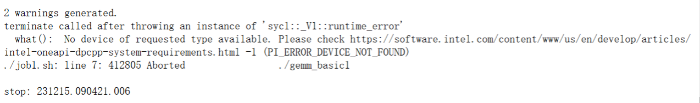

## 软件系统优化 A5

10211900416 郭夏辉

本次实验因为个人时间有限，仅完成了基本任务，并未完成bonus任务。

## 计算global坐标

改写gemm_basic代码26，27行，利用work group和local work item的坐标来计算global坐标https://github.com/pengzhao-intel/oneAPI_course/blob/main/code/gemm_basic.cpp#L26

原来是这样的：

```c
              int row = index.get_global_id(0);
              int col = index.get_global_id(1);
```

修改后是这样的：

```c
              int row = index.get_group(0) * block_size + index.get_local_id(0);
              int col = index.get_group(1) * block_size + index.get_local_id(1);
```

运行的脚本文件如下所示。其中`source /opt/intel/oneapi/setvars.sh > /dev/null 2>&1`是为了配置环境变量(否则可能无法使用dpcpp命令)

```shell
echo
echo start: $(date "+%y%m%d.%H%M%S.%3N")
echo

source /opt/intel/oneapi/setvars.sh > /dev/null 2>&1
dpcpp gemm_basic1.cpp -o gemm_basic1
./gemm_basic1

echo
echo stop: $(date "+%y%m%d.%H%M%S.%3N")
echo
```

运行之后出现了两个warning,提示某些函数已经deprecated(已过时)，这个不用管；但是出现的这个错误却直接让自己的实验进行不下去了：



这是为什么呢？因为目前这个节点并不包括GPU设备，但是异构计算却需要有GPU的参与，我在此之前压根就没有使用qsub来提交自己的脚本文件，这当然是无法进行后续的利用可用节点的GPU设备来运行脚本工作啦。

执行`qsub -l nodes=1:gpu:ppn=2 -d . job1.sh `之后发现运行结果已经写入到本目录下面的 job1.sh.o2448513 文件了，运行结果如下所示：

```

########################################################################
#      Date:           Fri Dec 15 09:19:44 AM PST 2023
#    Job ID:           2448513.v-qsvr-1.aidevcloud
#      User:           u208507
# Resources:           cput=75:00:00,neednodes=1:gpu:ppn=2,nodes=1:gpu:ppn=2,walltime=06:00:00
########################################################################


start: 231215.091946.086

Problem size: c(1024,1024) = a(1024,1024) * b(1024,1024)

Performance Flops = 2147483648.000000, 
GPU Computation Time = 117.186693 (ms); 
CPU Computaiton Time = 442.289752 (ms); 

stop: 231215.092009.867

########################################################################
# End of output for job 2448513.v-qsvr-1.aidevcloud
# Date: Fri Dec 15 09:20:09 AM PST 2023
########################################################################


```


## 修改程序输入数据的大小

设定 M=N=K=2000

原来的代码：

```c
int errCode = gemm(1024, 1024, 1024, 4, 10, my_gpu_queue);
```

修改后的代码：

```c
  int errCode = gemm(2000, 2000, 2000, 4, 10, my_gpu_queue);
```

类比第一小问的经验，重新改代码、脚本，再用qusb进行提交，运行的结果在本目录下面的 job2.sh.o2448525 文件，内容如下所示：

```

########################################################################
#      Date:           Fri Dec 15 09:32:11 AM PST 2023
#    Job ID:           2448525.v-qsvr-1.aidevcloud
#      User:           u208507
# Resources:           cput=75:00:00,neednodes=1:gpu:ppn=2,nodes=1:gpu:ppn=2,walltime=06:00:00
########################################################################


start: 231215.093214.990

Problem size: c(2000,2000) = a(2000,2000) * b(2000,2000)

Performance Flops = 16000000000.000000, 
GPU Computation Time = 1109.523560 (ms); 
CPU Computaiton Time = 5096.731445 (ms); 

stop: 231215.093447.462

########################################################################
# End of output for job 2448525.v-qsvr-1.aidevcloud
# Date: Fri Dec 15 09:34:47 AM PST 2023
########################################################################


```

本来这个实验做到这里就结束了，但是助教于12月18日在课程群里说：

>推荐各位在程序初始化时设置随机数种子，并在实验过程中保持随机数种子不变。调小位于 71 行的判断差异的阈值，从 1e-3 下调。在完成实验的过程中，不要将验证能否正常通过作为唯一评判标准，请根据自己的思考对代码进行修改，并做好注释。

可以看到，本来我的实验就这样跑通了，但是并没有加上判断边界条件的代码，所以还是存在一些不严谨性。

在gemm_basic.cpp文件的gpu_kernel函数中，有一段是这样写的：

```c++
  // define the workgroup size and mapping
  auto grid_rows = (M + block_size - 1) / block_size * block_size;
  auto grid_cols = (N + block_size - 1) / block_size * block_size;
```

在计算机系统中学过舍入的我们看到这个就清楚，这个的意思是确保grid_rows和grid_cols严格满足blcok_size的倍数。

如果M,N不是block_size的整数倍了，grid_rows和grid_cols就分别对应右边那堆运算向上取整后的结果。

通过阅读gemm_basic.cpp，我们可以看到这里的矩阵乘法是通过一维数组实现的，这样的话如果出现M,N不是block_size的整数倍情况，就有可能出现覆盖情况（**类比**之前向量化不能进行的覆盖），当然越界问题也难以避免，其实问题主要就出现在这里：

```c++
              for (int i = 0; i < K; i++) {
                sum += A[row * K + i] * B[i * N  + col];
              }
              C[row * N + col] = sum;
```

row超了范围就越界了，col超了范围就覆盖了。

如果要改对，其实也很简单，就是加一个额外的判定就行

但是要在循环开始运行前就加特判：

```c++
              float sum = 0.0f;
              if (row >= M) row = M - 1;
              if (col >= N) col = N - 1;
              for (int i = 0; i < K; i++) {
                sum += A[row * K + i] * B[i * N  + col];
              }
              C[row * N + col] = sum;
```

加了特判之后，我把它存为gemm_basic3.cpp,然后再写了个脚本来运行，运行结果存在job3.sh.o2452477

```

########################################################################
#      Date:           Fri Dec 22 08:28:18 AM PST 2023
#    Job ID:           2452477.v-qsvr-1.aidevcloud
#      User:           u208507
# Resources:           cput=75:00:00,neednodes=1:gpu:ppn=2,nodes=1:gpu:ppn=2,walltime=06:00:00
########################################################################


start: 231222.082820.222

Problem size: c(2000,2000) = a(2000,2000) * b(2000,2000)

Performance Flops = 16000000000.000000, 
GPU Computation Time = 877.272467 (ms); 
CPU Computaiton Time = 2288.141309 (ms); 

stop: 231222.082937.341

########################################################################
# End of output for job 2452477.v-qsvr-1.aidevcloud
# Date: Fri Dec 22 08:29:37 AM PST 2023
########################################################################
```

依然正常运行

