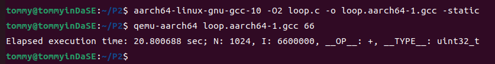
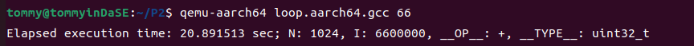

## 软件系统优化 P2

10211900416 郭夏辉

## 项目要求

在 Ubuntu/X64 上分别用 gcc 和 clang 去交叉编译一个 C 程序，生成不同版本的aarch64 (64-bit ARM ISA) 可执行文件，在 Ubuntu/X64 上用 aarch64 的Qemu 仿真器去分别运行不同编译器交叉编译生成的 aarch64 可执行文件，进行性能比较，并进一步掌握在Ubuntu/X64 上用 gdb 调试 aarch64 可执行文件的方法。

## 任务1 在 Ubuntu 上安装能够运行aarch64 (64-bit ARMISA)应用的 Qemu 虚拟机（qemu-aarch64）

我选择的安装方法是根据官网的示范[^1]运行如下指令：

```
wget https://download.qemu.org/qemu-8.2.0-rc1.tar.xz
tar xvJf qemu-8.2.0-rc1.tar.xz
cd qemu-8.2.0-rc1
./configure
make
```

但是在 ./configure 时显示没有安装Ninja,glib等软件，我一一使用apt进行安装，此处就不赘述了（其实这里花费了我很多很多的时间解决依赖关系，降级软件、安装一些对应的python包）。在一番努力之后，我 ./configure 终于不再有ERROR了：


在这之后我make编译,make install进行软件安装。


**检验是否安装成功**：


## 任务2 安装 aarch64 的GCC 工具链(gcc-10-aarch64-linux-gnu)

这个我直接使用apt-get进行安装了（sudo apt-get install gcc-10-aarch64-linux-gnu）

**检验是否安装成功**：


## 任务3 用 aarch64 的 GCC 工具链交叉编译loop.c (-O2)，生成可执行文件 loop.aarch64.gcc，并用qemu-aarch64运行loop.aarch64.gcc

注意：运行 loop.aarch64.gcc 时需要带一个大于 0 且小于等于100 的参数

使用aarch64来交叉编译loop.c,生成可执行文件:

```shell
aarch64-linux-gnu-gcc-10 -O2 loop.c -o loop.aarch64.gcc
```


运行可执行文件：

```
qemu-aarch64 loop.aarch64.gcc 66
```

结果我出现了这样的报错：


在网上查阅了一些资料后我了解到，QEMU在用户态模拟各平台程序时，若程序是动态编译的，那么就不会带入到目标平台动态链接库。因此，要想解决这个问题，我需要手动地进行动态链接的工作或者在程序构建时采用静态链接（加-static参数）[^2] [^3] 

我两种方法都试了一下，先尝试的是第二种方法(因为简单)：



再尝试了一下第一种方法。这个方法中，我要将目标平台的动态链接库放到指定位置。根据刚刚的实验我们能发现缺少的动态链接库是ld-linux-aarch64.so.1，我先来找一下它到底在哪：


查到之后去把/usr/aarch64-linux-gnu/lib/ld-linux-aarch64.so.1复制到 /lib 目录：


再来运行：


发现libc.so.6我忘记复制了，再走一遍相类似的工作后运行成功了：



## 任务4 用 clang 交 叉 编 译 loop.c(-O2) ，生成可执行文件loop.aarch64.clang ， 并用qemu-aarch64运行loop.aarch64.clang

吸取在任务4时的教训，我这次乖乖地在编译生成可执行文件时就加上了-static选项，采用静态链接会增加一些编译的时间与空间消耗，但是性能上会比动态链接好一点（虽然在这个实验中性能上的优势可以忽略不计）：

```shell
clang -target aarch64-linux-gnu loop.c -o loop.aarch64.clang -O2 -static
```

然后运行：

```
qemu-aarch64 loop.aarch64.clang 66
```


## 任务5 用 qemu-aarch64 分 别 运行前面编译出来的loop.aarch64.gcc 和 loop.aarch64.clang（分别用参数5、15、30、60、90 进行测试），记下每次测试的执行时间并以图形方式呈现。

这个任务我类似作业A4时的Writeup-8，写了个脚本来运行。也类似于A4,为了减小实验误差对结果的影响，我采用了运行多次取均值的方法，此次实验采取的运行次数为10。

可执行脚本test.sh:

```shell
n=10
RESULTS="results.txt"
inp=(5 15 30 60 90)

echo "gcc" >> $RESULTS
#gcc
for i in ${inp[@]}
do
    time1="0"
    exec="qemu-aarch64 loop.aarch64.gcc $i"
    for j in $(seq 1 $n)
    do
        tmp=$($exec | grep "sec" | grep -o "[0-9]*\.[0-9]*" )
        time1=$(echo "$tmp + $time1" | bc -l)
    done
    time1=$(echo "$time1 / $n" | bc -l)
    echo "$i : $time1" >> $RESULTS
done


echo "clang" >> $RESULTS
#clang
for i in ${inp[@]}
do
    time1="0"
    exec="qemu-aarch64 loop.aarch64.clang $i"
    for j in $(seq 1 $n)
    do
        tmp=$($exec | grep "sec" | grep -o "[0-9]*\.[0-9]*" )
        time1=$(echo "$tmp + $time1" | bc -l)
    done
    time1=$(echo "$time1 / $n" | bc -l)
    echo "$i : $time1" >> $RESULTS
done
```

然后我将两者的结果以可视化形式呈现（画图工作在plot.ipynb中）：


可以看到，随着输入参数的增大，程序的运行时间非常近似地线性增长（两者所作出来的图都近乎直线）；无论输入的参数如何，clang编译器生成的程序运行时间要比gcc生成的少，体现了clang比gcc在O2下更优秀的优化表现。

## 任务6 用 host 机 器 上 的 gcc 和clang 分别编译(-O2)出loop.x64.gcc 和 loop.x64.clang，并对这两个执行文件分别用参数 5、15、30、60、90 进行测试，记下每次测试的执行时间并以图形方式呈现，进而与前一步qemu仿真测试的结果进行比较。

在开始之前我要先编译生成相应的可执行文件：

```shell
gcc -O2 loop.c -o loop.x64.gcc -static
clang -O2 loop.c -o loop.x64.clang -static
```

这个任务的操作与前面的类似，我还是写了一个脚本来运行（test1.sh）:

```shell
n=10
RESULTS="results1.txt"
inp=(5 15 30 60 90)

chmod +777 loop.x64.gcc
chmod +777 loop.x64.clang

echo "gcc" >> $RESULTS
#gcc
for i in ${inp[@]}
do
    time1="0"
    exec="./loop.x64.gcc $i"
    for j in $(seq 1 $n)
    do
        tmp=$($exec | grep "sec" | grep -o "[0-9]*\.[0-9]*" )
        time1=$(echo "$tmp + $time1" | bc -l)
    done
    time1=$(echo "$time1 / $n" | bc -l)
    echo "$i : $time1" >> $RESULTS
done


echo "clang" >> $RESULTS
#clang
for i in ${inp[@]}
do
    time1="0"
    exec="./loop.x64.clang $i"
    for j in $(seq 1 $n)
    do
        tmp=$($exec | grep "sec" | grep -o "[0-9]*\.[0-9]*" )
        time1=$(echo "$tmp + $time1" | bc -l)
    done
    time1=$(echo "$time1 / $n" | bc -l)
    echo "$i : $time1" >> $RESULTS
done
```

然后我将两者的结果以可视化形式呈现（画图工作在plot.ipynb中）：


可以看到，在这次的结果中，clang的表现还是比gcc好，而且好的程度似乎比任务5时的要更大一些；而且即便是在host机器上，两种编译器生成的程序的运行时间也非常近似地线性增长。

然后与任务5中的结果放在一起对比：


与之前的对比，可以发现：

1. clang生成的可执行文件比gcc的运行速度更快

为了解释这个问题，我以host机器情况下为例，用两种编译器生成了对应的汇编代码去研究：

```shell
gcc -O2 -S loop.c -o loop.x64.gcc.s
clang -O2 -S loop.c -o loop.x64.clang.s
```

类似于A4那样我对两者的汇编代码进行了一些分析，gcc生成的是这样：


clang生成的是这样：


两者的逻辑都是类似的，但是可以很明显地看到gcc并没有向量化，但是clang却进行了向量化（虽然向量化的程度有待提升）。后者这样的优化，大幅提升了运行的效率。

2. 无论是clang还是gcc,在qemu-aarch64情况下都比host情况下低效。

这里我觉得qemu情况下因为仿真带来了一些额外的工作，造成了一定的性能损失，所以不如直接在x86-64平台下效率高。

## 任务7 安装支持多 ISA 的 gdb 调试器（gdb-multiarch）

我还是使用的apt直接进行安装的（sudo apt-get install gdb-multiarch）：


安装成功的验证：


## 任务8 用 gdb-multiarch 结合qemu-aarch64对loop.aarch64.gcc.debug 进行源码级调试

首先我要编译生成有调试信息的loop.aarch64.gcc.debug：

```shell
aarch64-linux-gnu-gcc-10 -O2 -ggdb loop.c -o loop.aarch64.gcc.debug -static
```

然后我就要来具体的进行调试了，这里我介绍一下相应的调试方法。

1. 打开一个端口来调试（qemu-aarch64 -g 6666 ./loop.aarch64.gcc.debug）这里我选择的是6666端口：


可以看到打开这个端口之后这个终端就被阻塞了，所以我要另开一个终端来连接它。

2. 新开一个终端，在新终端中利用gdb-multiarch来进行调试（gdb-multiarch loop.aarch64.gcc.debug）：


3. 连接我设定的端口上的qemu-aarch64：


现在就可以利用诸如b,c,n这样的gdb调试命令正式开始调试了。

我按了两次c之后程序收到了SIGABRT信号就终止了：


出现这个问题的原因是我在第一个终端中打开的qemu-aarch64缺少参数，我将其这样修正：


然后再跑到第二个终端中连接并continue:


再返回第一个终端：


可以看到程序正常地结束了。

为了尽量多地体会一下gdb调试，我接下来想打断点来看看程序运行时各变量的值。程序的主要代码如下所示：


我首先在76行打了一个断点，在此时有个很离谱的事情是i和j的值都打印不出来：


这里应该是经历了O2优化，所以具体的值都是optimized out,无法输出。为了验证自己的猜想，我不开启优化选项测试了一下：


可以很明显地看到，在不开启优化时，这些中间变量的值都是可以被print的，这验证了我的猜想。看来优化虽能提速，但是可能让调试过程更加捉摸不透了。

## 引用和参考

[^1]: QEMU download : https://www.qemu.org/download/

[^2]: qemu-aarch64: Could not open '/lib/ld-linux-aarch64.so.1': No such file or directory : https://unix.stackexchange.com/questions/751329/qemu-aarch64-could-not-open-lib-ld-linux-aarch64-so-1-no-such-file-or-direc

[^3]: https://blog.csdn.net/FJDJFKDJFKDJFKD/article/details/112828882
