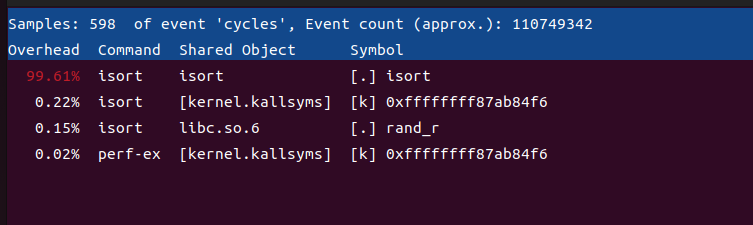

## 软件系统优化 P3

10211900416 郭夏辉

请阅读和练习文档内容，注意：

（1）忽略文档中关于 AWSRUN 和 Git 相关的内容；

（2） Exercise 自行练习，结果无需提交。

- 将 awsrun perf record 替换为 perf record。 

- 将 aws-perf-report 替换为 perf report。 

- 记录 lscpu 的执行结果。

## lscpu的执行结果

```shell
tommy@tommyindase:~/P3$ lscpu
架构：                   x86_64
  CPU 运行模式：         32-bit, 64-bit
  Address sizes:         45 bits physical, 48 bits virtual
  字节序：               Little Endian
CPU:                     8
  在线 CPU 列表：        0-7
厂商 ID：                AuthenticAMD
  型号名称：             AMD Ryzen 7 4800H with Radeon Graphics
    CPU 系列：           23
    型号：               96
    每个核的线程数：     1
    每个座的核数：       2
    座：                 4
    步进：               1
    BogoMIPS：           5789.12
    标记：               fpu vme de pse tsc msr pae mce cx8 apic sep mtrr pge mc
                         a cmov pat pse36 clflush mmx fxsr sse sse2 ht syscall n
                         x mmxext fxsr_opt pdpe1gb rdtscp lm constant_tsc rep_go
                         od nopl tsc_reliable nonstop_tsc cpuid extd_apicid tsc_
                         known_freq pni pclmulqdq ssse3 fma cx16 sse4_1 sse4_2 x
                         2apic movbe popcnt aes xsave avx f16c rdrand hypervisor
                          lahf_lm cmp_legacy extapic cr8_legacy abm sse4a misali
                         gnsse 3dnowprefetch osvw topoext ssbd ibpb vmmcall fsgs
                         base bmi1 avx2 smep bmi2 rdseed adx smap clflushopt clw
                         b sha_ni xsaveopt xsavec xgetbv1 clzero wbnoinvd arat u
                         mip rdpid overflow_recov succor
Virtualization features: 
  超管理器厂商：         VMware
  虚拟化类型：           完全
Caches (sum of all):     
  L1d:                   256 KiB (8 instances)
  L1i:                   256 KiB (8 instances)
  L2:                    4 MiB (8 instances)
  L3:                    16 MiB (4 instances)
NUMA:                    
  NUMA 节点：            1
  NUMA 节点0 CPU：       0-7
Vulnerabilities:         
  Gather data sampling:  Not affected
  Itlb multihit:         Not affected
  L1tf:                  Not affected
  Mds:                   Not affected
  Meltdown:              Not affected
  Mmio stale data:       Not affected
  Retbleed:              Mitigation; untrained return thunk; SMT disabled
  Spec rstack overflow:  Mitigation; SMT disabled
  Spec store bypass:     Mitigation; Speculative Store Bypass disabled via prctl
  Spectre v1:            Mitigation; usercopy/swapgs barriers and __user pointer
                          sanitization
  Spectre v2:            Mitigation; Retpolines, IBPB conditional, STIBP disable
                         d, RSB filling, PBRSB-eIBRS Not affected
  Srbds:                 Not affected
  Tsx async abort:       Not affected
tommy@tommyindase:~/P3$ 
```

## Checkoff Item 1

**Make note of one bottleneck.** 

perf安装成功了嘛？


编译isort:


使用perf需要加上sudo授权：


然后再用perf report查看这个报告：



可以看到isort这个程序占据了99.61%的运行时间，瓶颈主要在isort程序。

因为对perf实在不太熟练，所以我也没有接着探索了，有点遗憾。

## Checkoff Item 2

Run sum under cachegrind to identify cache performance. It may take a little while. 

In the output, look at the D1 and LLd misses. D1 represents the lowest-level cache (L1), and LL represents the last (highest) level data cache (on most machines, L3). 

Do these numbers correspond with what you would expect? Try playing around with the values N and U in sum.c. How can you bring down the number of cache misses?

valgrind是否安装？


编译sum:


使用valgrind分析缓存情况:


在最开始lscpu环节，我的caches情况是这样的：

```
Caches (sum of all):     
  L1d:                   256 KiB (8 instances)
  L1i:                   256 KiB (8 instances)
  L2:                    4 MiB (8 instances)
  L3:                    16 MiB (4 instances)
```

D1表示最低等级的缓存，即L1 cache。LLd表示最高等级的缓存，即L3 cache.

由于L3 cache显著大于L1 cache的大小，因此理论上来说LLd的miss rate要比D1的小一些，实际情况也是如此：

D1 miss了100,546,729次,miss rate 16.5%

LLd miss了79,723,104次,miss rate 13.1%

我还发现一个很有趣的现象，就是写入操作的不命中率比读取操作的不命中率低的多，这主要是因为sum函数中以读取数据为主，写入工作并不是很多。

接下来我来看sum.c发现里面两句话:

```c
const int U = 10000000;   // size of the array. 10 million vals ~= 40MB
const int N = 100000000;  // number of searches to perform
```

结合之后的代码（此处省略了），我们可以看到U主要是在控制程序块大小，此时数据的内存占用约为40MB。但是我的L3 cache最大容量才16MB,无法容纳整个数组，我将其修改为初始情况下的$\frac{2}{5}$便可以适应自己的L3 cache了（U=4000000）。

在修改之后,make clean,make sum再valgrind --tool=cachegrind --branch-sim=yes ./sum之后的运行结果如下：


可以看到L1 cache的miss rate基本没有变化（16.6%）但是L3 cache的miss rate明显降低了（7.9%），但依然不是0。

刚刚这个我考虑的是让U的大小适合L3 cache的大小，如果为更近一步让其适合L1 cache的大小呢？就是将U修改为65536（$\frac{256*1024B}{4B}=65536$），然后再走一遍类似的流程结果是这样的：


可以看到，L1 cache的miss rate下降了一点点，L3 cache的miss rate却下降到了0

为什么L1 cache的miss rate没有下降到0？这真的是一个巨大的问题，这个与理论上的情况并不相符，难道是我最开始lscpu看到的数据就是错误的吗？

又看了一下lscpu的数据，我发现自己当时给这台虚拟机设置了4个处理器，每个处理器都是双核的，这样的话我们学习的理论可能并不适用（因为CSAPP中讨论缓存miss rate有一个大前提——单核单处理器）

在vmware中为1核1处理器之后我再来进行实验(明显感觉慢了很多)。首先来lscpu,发现情况和之前的有所不同：

```
tommy@tommyindase:~/P3$ lscpu
架构：                   x86_64
  CPU 运行模式：         32-bit, 64-bit
  Address sizes:         45 bits physical, 48 bits virtual
  字节序：               Little Endian
CPU:                     1
  在线 CPU 列表：        0
厂商 ID：                AuthenticAMD
  型号名称：             AMD Ryzen 7 4800H with Radeon Graphics
    CPU 系列：           23
    型号：               96
    每个核的线程数：     1
    每个座的核数：       1
    座：                 1
    步进：               1
    BogoMIPS：           5789.12
    标记：               fpu vme de pse tsc msr pae mce cx8 apic sep mtrr pge mc
                         a cmov pat pse36 clflush mmx fxsr sse sse2 syscall nx m
                         mxext fxsr_opt pdpe1gb rdtscp lm constant_tsc rep_good 
                         nopl tsc_reliable nonstop_tsc cpuid extd_apicid tsc_kno
                         wn_freq pni pclmulqdq ssse3 fma cx16 sse4_1 sse4_2 x2ap
                         ic movbe popcnt aes xsave avx f16c rdrand hypervisor la
                         hf_lm extapic cr8_legacy abm sse4a misalignsse 3dnowpre
                         fetch osvw topoext ssbd ibpb vmmcall fsgsbase bmi1 avx2
                          smep bmi2 rdseed adx smap clflushopt clwb sha_ni xsave
                         opt xsavec xgetbv1 clzero wbnoinvd arat umip rdpid over
                         flow_recov succor
Virtualization features: 
  超管理器厂商：         VMware
  虚拟化类型：           完全
Caches (sum of all):     
  L1d:                   32 KiB (1 instance)
  L1i:                   32 KiB (1 instance)
  L2:                    512 KiB (1 instance)
  L3:                    4 MiB (1 instance)
NUMA:                    
  NUMA 节点：            1
  NUMA 节点0 CPU：       0
Vulnerabilities:         
  Gather data sampling:  Not affected
  Itlb multihit:         Not affected
  L1tf:                  Not affected
  Mds:                   Not affected
  Meltdown:              Not affected
  Mmio stale data:       Not affected
  Retbleed:              Mitigation; untrained return thunk; SMT disabled
  Spec rstack overflow:  Mitigation; SMT disabled
  Spec store bypass:     Mitigation; Speculative Store Bypass disabled via prctl
  Spectre v1:            Mitigation; usercopy/swapgs barriers and __user pointer
                          sanitization
  Spectre v2:            Mitigation; Retpolines, IBPB conditional, STIBP disable
                         d, RSB filling, PBRSB-eIBRS Not affected
  Srbds:                 Not affected
  Tsx async abort:       Not affected
tommy@tommyindase:~/P3$ 
```

关于缓存的信息：

```
Caches (sum of all):     
  L1d:                   32 KiB (1 instance)
  L1i:                   32 KiB (1 instance)
  L2:                    512 KiB (1 instance)
  L3:                    4 MiB (1 instance)
```

然后我再据此进行对应的改动。

先把U改成1000000对应L3 cache的大小，运行`make clean ; make sum ; valgrind --tool=cachegrind --branch-sim=yes ./sum`结果如下：


可以看到L1 cache的miss rate基本没有变化（16.5%）但是L3 cache的miss rate如同理论那样降到了近似于0

再来改U为16384对应L1 cache的大小，运行`make clean ; make sum ; valgrind --tool=cachegrind --branch-sim=yes ./sum`结果如下，情况有点不对劲：


到这里我才发现自己粗心了，竟然犯了如此低级的运算错误——32 KiB对应的是8192个int而不是16384个！修改之后再运行：


可以看到，终于如预期基本一致了！

看来，对于多处理器多核这样的复杂情况，还是不能简单地套用理论知识，这背后还是有不少很深奥的学问。自己这次能发现这个细节，感觉存在一定的运气成分，之后还是要多钻研。

之后我又重启把电脑由单核变回了最初的样子。

## Write-up 1

 Compare the Cachegrind output on the DEBUG=1 code versus DEBUG=0 compiler optimized code. 

Explain the advantages and disadvantages of using instruction count as a substitute for time when you compare the performance of different versions of this program. 

先进入homework文件夹，运行`make clean ; make sort DEBUG=0 ; valgrind --tool=cachegrind --branch-sim=yes ./sort 100000 10`  结果如下：

```
tommy@tommyindase:~/P3/homework$ make clean ; make sort DEBUG=0 ; valgrind --tool=cachegrind --branch-sim=yes ./sort 100000 10
rm -f ./sort *.std* *.gcov *.gcda *.gcno default.profraw
clang main.c tests.c util.c isort.c sort_a.c sort_c.c sort_i.c sort_p.c sort_m.c sort_f.c -O3 -DNDEBUG -g -Wall -std=gnu99 -gdwarf-3 -always-inline -lrt -lm  -o sort
clang: warning: argument unused during compilation: '-always-inline' [-Wunused-command-line-argument]
==2963== Cachegrind, a cache and branch-prediction profiler
==2963== Copyright (C) 2002-2017, and GNU GPL'd, by Nicholas Nethercote et al.
==2963== Using Valgrind-3.18.1 and LibVEX; rerun with -h for copyright info
==2963== Command: ./sort 100000 10
==2963== 
--2963-- warning: L3 cache found, using its data for the LL simulation.

Running test #0...
Generating random array of 100000 elements
Arrays are sorted: yes
 --> test_correctness at line 217: PASS
sort_a		: Elapsed execution time: 0.247328 sec
sort_a repeated	: Elapsed execution time: 0.246163 sec
Generating inverted array of 100000 elements
Arrays are sorted: yes
 --> test_correctness at line 217: PASS
sort_a		: Elapsed execution time: 0.492830 sec
sort_a repeated	: Elapsed execution time: 0.491841 sec

Running test #1...
 --> test_zero_element at line 245: PASS

Running test #2...
 --> test_one_element at line 266: PASS
Done testing.
==2963== 
==2963== I   refs:      2,783,693,443
==2963== I1  misses:            1,774
==2963== LLi misses:            1,666
==2963== I1  miss rate:          0.00%
==2963== LLi miss rate:          0.00%
==2963== 
==2963== D   refs:      1,015,802,272  (614,857,022 rd   + 400,945,250 wr)
==2963== D1  misses:        6,395,771  (  3,334,323 rd   +   3,061,448 wr)
==2963== LLd misses:           27,330  (      1,608 rd   +      25,722 wr)
==2963== D1  miss rate:           0.6% (        0.5%     +         0.8%  )
==2963== LLd miss rate:           0.0% (        0.0%     +         0.0%  )
==2963== 
==2963== LL refs:           6,397,545  (  3,336,097 rd   +   3,061,448 wr)
==2963== LL misses:            28,996  (      3,274 rd   +      25,722 wr)
==2963== LL miss rate:            0.0% (        0.0%     +         0.0%  )
==2963== 
==2963== Branches:        305,588,847  (288,588,142 cond +  17,000,705 ind)
==2963== Mispredicts:      12,018,591  ( 12,018,282 cond +         309 ind)
==2963== Mispred rate:            3.9% (        4.2%     +         0.0%   )
```

再运行`make clean ; make sort DEBUG=1 ; valgrind --tool=cachegrind --branch-sim=yes ./sort 100000 10`  结果如下：

```
tommy@tommyindase:~/P3/homework$ make clean ; make sort DEBUG=1 ; valgrind --tool=cachegrind --branch-sim=yes ./sort 100000 10
rm -f ./sort *.std* *.gcov *.gcda *.gcno default.profraw
clang main.c tests.c util.c isort.c sort_a.c sort_c.c sort_i.c sort_p.c sort_m.c sort_f.c -DDEBUG -O0 -g -Wall -std=gnu99 -gdwarf-3 -always-inline -lrt -lm  -o sort
clang: warning: argument unused during compilation: '-always-inline' [-Wunused-command-line-argument]
==2984== Cachegrind, a cache and branch-prediction profiler
==2984== Copyright (C) 2002-2017, and GNU GPL'd, by Nicholas Nethercote et al.
==2984== Using Valgrind-3.18.1 and LibVEX; rerun with -h for copyright info
==2984== Command: ./sort 100000 10
==2984== 
--2984-- warning: L3 cache found, using its data for the LL simulation.

Running test #0...
Generating random array of 100000 elements
Arrays are sorted: yes
 --> test_correctness at line 217: PASS
sort_a		: Elapsed execution time: 0.443586 sec
sort_a repeated	: Elapsed execution time: 0.442727 sec
Generating inverted array of 100000 elements
Arrays are sorted: yes
 --> test_correctness at line 217: PASS
sort_a		: Elapsed execution time: 0.868172 sec
sort_a repeated	: Elapsed execution time: 0.867536 sec

Running test #1...
 --> test_zero_element at line 245: PASS

Running test #2...
 --> test_one_element at line 266: PASS
Done testing.
==2984== 
==2984== I   refs:      4,676,551,362
==2984== I1  misses:            1,731
==2984== LLi misses:            1,632
==2984== I1  miss rate:          0.00%
==2984== LLi miss rate:          0.00%
==2984== 
==2984== D   refs:      3,072,540,949  (2,300,220,959 rd   + 772,319,990 wr)
==2984== D1  misses:        6,381,209  (    3,332,072 rd   +   3,049,137 wr)
==2984== LLd misses:           27,276  (        1,566 rd   +      25,710 wr)
==2984== D1  miss rate:           0.2% (          0.1%     +         0.4%  )
==2984== LLd miss rate:           0.0% (          0.0%     +         0.0%  )
==2984== 
==2984== LL refs:           6,382,940  (    3,333,803 rd   +   3,049,137 wr)
==2984== LL misses:            28,908  (        3,198 rd   +      25,710 wr)
==2984== LL miss rate:            0.0% (          0.0%     +         0.0%  )
==2984== 
==2984== Branches:        459,057,080  (  442,056,402 cond +  17,000,678 ind)
==2984== Mispredicts:      35,200,584  (   35,200,287 cond +         297 ind)
==2984== Mispred rate:            7.7% (          8.0%     +         0.0%   )

```

首先直观来看，DEBUG=0时程序的运行性能要比DEBUG=1时更好一些。

细细对比来看，两者的运行结果差异主要如下：

|         | I   refs      | D   refs      | Branches    | Mispred rate |
| ------- | ------------- | ------------- | ----------- | ------------ |
| DEBUG=0 | 2,783,693,443 | 1,015,802,272 | 305,588,847 | 3.9%         |
| DEBUG=1 | 4,676,551,362 | 3,072,540,949 | 459,057,080 | 7.7%         |

可以看到，DEBUG=0时进行读取操作的指令数量比DEBUG=1时少很多；分支的数量DEBUG=0时也要小一些；分支预测准确率DEBUG=0时也要更高一些。

究其原因，在DEBUG=0时编译器开启了O3优化，但是在DEBUG=1时编译器却只有O0优化（相当于什么优化也不做）。DEBUG=0时候编译器应该进行了一些更为激进的优化。至于大概有什么优化，前面的几次实验其实也有所介绍，这里就不多赘述了，但是我们可以看到指令数和性能确实存在着某种关联。

题目还让我解释使用指令计数替代程序运行时间的优点和缺点。在理论课程中，我们学习过了Iron Law(Lec14 微架构性能分析方法):

$\frac{CPU Time}{Program}=\frac{Instructions}{Program}\frac{Clock Cycles}{Instructions}\frac{CPU Time}{Clock Cycles}$ 

如果使用指令计数，只能影响第一项$\frac{Instructions}{Program}$,忽略了流水线（第二项，比如分支预测）和硬件（第三项，比如CPU频率）的影响，这是使用指令计数替代程序运行时间的问题所在——没有对程序进行全面的运行时间考量；这也是使用指令计数的优势所在——甚至都没有运行程序就大概得知了程序的性能，比较简单操作。一般而言，如果某个系统后两项是确定的，我们通过指令计数替代程序运行时间判别的准确性就要高很多。

## Write-up 2（选做）

Explain which functions you chose to inline and report the performance differences you observed between the inlined and uninlined sorting routines. 

我先按照要求，将sort_a.c中代码复制到了sort_i.c中，并且将那三个函数（sort_a(),merge_a(),copy_a() ）更改了函数名（_a后缀改成了\_i后缀）。

我们选择一个函数来内联需要认真考虑，内联函数是代码被插入到调用者代码处的函数，通过避免被调用的开销来提高执行效率，内联的副作用是目标代码的体积会发生膨胀。如果函数体很小且被频繁调用，内联通常来说较为合适，但是如递归函数那样，由于递归深度往往较深内联的话会反复地复制代码，导致体积庞大到无法接受却并没有什么实质性的性能提升。从这个角度来说，sort_i这个函数不适合内联。对于merge_i这个函数来说，由于它不仅调用次数较多，而且体积还略庞大一些（进行的工作比较多），我觉得它也不太适合内联。综合来看，我认为sort_i.c中最适合内联的是copy_i 

但是这就结束了吗？其实mem_alloc和mem_free这两个函数我发现也符合自己寻求的适合内联的特点——结构简单，调用频繁，因此我也将它们内联了。这两个函数的具体代码在util.c中，为了内联它们且不影响后续实验，我将util.c中这两个函数的代码复制了过来。复制过来之后需要把sort_i.c中`#include "./util.h"`给注释掉，然后将util.h中一些必要的库再给复制进来。

还有最后一步，就是去把main.c中的sort_i前面的注释给清除，然后注释掉sort_a:


但改完之后我才意识到自己不应该这样改，因为这样改了之后我的sort_i去和谁对比呀？所以我又改了回来：


改完代码之后，输入`make clean ; make ; valgrind --tool=cachegrind --branch-sim=yes ./sort 100000 10` 输出结果如下所示：


可以看到在我内联之后，性能并没有获得什么提升，甚至还发生了一点点退步。

透过make的语句,我发现这里采用的是O3优化:

```
tommy@tommyindase:~/P3/homework$ make clean ; make
rm -f ./sort *.std* *.gcov *.gcda *.gcno default.profraw
clang main.c tests.c util.c isort.c sort_a.c sort_c.c sort_i.c sort_p.c sort_m.c sort_f.c -O3 -DNDEBUG -g -Wall -std=gnu99 -gdwarf-3 -always-inline -lrt -lm  -o sort
clang: warning: argument unused during compilation: '-always-inline' [-Wunused-command-line-argument]
```

我在想，是不是O3的优化水平实在是太高了，以至于内联这种普通的优化有些小巫见大巫了，所以我尝试着把优化等级从O3改成了O0（修改makefile对应语句即可）,再来进行一次尝试。运行结果比较长，我将测试完成之后的报告给截去了：


现在，终于能看到那一点点小小的性能差异了。排除实验误差的干扰，我们可以认为合适的内联确实可能减少频繁的内存访问，提升程序运行的效率，但是这个提升并不显著。

由于我刚刚的一些修改可能影响之后的实验，我还是需要把它们复位的。

## Write-up 3（选做）

Explain the possible performance downsides of inlining recursive functions. 

How could profiling data gathered using cachegrind help you measure these negative performance effects? 

其实我有在Write-up 2中选择要内联的函数时说明了为何不将递归的函数、递归函数中调用的部分内联之原因，此处我再来详细阐述一下。

内联其实就是一个“替换”的过程，能减少函数调用的成本，并且能让汇编代码的连贯性增强。然而内联这个技术其实并不是很高妙，因为它首先不能改变缓存的命中率，其次并不会带来更高程度的向量化，甚至还有体积膨胀的副作用。假如函数多次被调用，并且它被内联了，那么代码的体积将会膨胀地很大以至于难以接受。递归又是一种特殊的调用——自己调用自己，递归的深度往往是较大的，这就更加剧了代码长度扩大的程度。当然，如果A函数是递归的，A函数内部一直在调用B函数，那么B函数显然也不太适合进行内联。

利用cachegrind,在内联和不内联情况下我分别来看结果。先来看不内联的：


再来看内联的：


在内联过后，缓存行预测的错误率下降了，但实际执行的条件分支指令的数量却有较大提高；缓存的不命中率如预期一样，并没有什么变化。

然而有个出乎意料的事情——I refs（程序执行期间对指令缓存的引用次数）内联过后反而下降了，D refs（程序执行期间对数据缓存的引用次数）内联后上升了，这一度让我以为自己产生了错觉。

直到自己发现Writeup 2结束之后我复位了先前的修改，Makefile中竟然还是O3优化！

改回O0优化之后再来看。首先是没有内联的：


再看内联过后的：


发现什么没？两者竟然十分相似！我感觉这可能是由于内联并没有真的发生，我还记得之前黄老师讲课时有言——难道inline了的函数一定会被内联吗？不是的，编译器会进行选择，有的函数inline了之后不仅没有沾到内联的好处，还吃到了体积膨胀的恶果。

## Write-up 4

Give a reason why using pointers may improve performance. Report on any performance differences you observed in your implementation. 

其实这个和write-up 2有点相似，先要把sort_a.c中的代码添加到sort_p.c中，但是需要做出一些修改。主要的修改其实就是把原本的数组引用转化为指针引用，修改后的代码如下：

```c
......
static void merge_p(data_t* A, int p, int q, int r) {
  assert(A);
  assert(p <= q);
  assert((q + 1) <= r);
  int n1 = q - p + 1;
  int n2 = r - q;

  data_t* left = 0, * right = 0;
  mem_alloc(&left, n1 + 1);
  mem_alloc(&right, n2 + 1);
  if (left == NULL || right == NULL) {
    mem_free(&left);
    mem_free(&right);
    return;
  }

  //copy_p(&(A[p]), left, n1);
  copy_p(A+p, left, n1);
  //copy_p(&(A[q + 1]), right, n2);
  copy_p(A+q+1, right, n2);
  //left[n1] = UINT_MAX;
  *(left+n1) = UINT_MAX;
  //right[n2] = UINT_MAX;
  *(right+n2) = UINT_MAX;

  /*
  int i = 0;
  int j = 0;

  for (int k = p; k <= r; k++) {
    if (left[i] <= right[j]) {
      A[k] = left[i];
      i++;
    } else {
      A[k] = right[j];
      j++;
    }
  }
  */
  data_t* l_cur = left, *r_cur = right;
  for(int k = p; k <= r; k++){
    if(*l_cur <= *r_cur){
      *(A+k) = *l_cur;
      l_cur++;
    }else{
      *(A+k) = *r_cur;
      r_cur++;
    }
  }
  mem_free(&left);
  mem_free(&right);
}
static void copy_p(data_t* source, data_t* dest, int n) {
  assert(dest);
  assert(source);

  for (int i = 0 ; i < n ; i++) {
    //dest[i] = source[i];
    *(dest+i) = *(source+i);
  }
}
```

但我觉得自己这个代码写的还不算好，因为还是有点数组化的风格——每次还要加一个偏移量i,这样就有很多无效运算。如果真的要写成指针化的代码，应该这样比较好，比如copy_p函数：

```c
static void copy_p(data_t* source, data_t* dest, int n) {
  assert(dest);
  assert(source);

  for (int i = 0 ; i < n ; i++) {
    //dest[i] = source[i];
    *(dest) = *(source);
    dest++;
    source++;
  }
}
```

但其实这个小小的代码习惯在结果面前已经不那么重要了，我开启O0优化（害怕O3优化再来打扰正常实验）后结果如下所示：


可以看到使用指针明显要比使用数组效率高一些，但高的不多。然后题目还要我们解释为何会出现这样的提升，我去看了一下两者的汇编代码。我先把sort这个可执行文件反汇编，然后在其中能找到merge_a,copy_a和merge_p,copy_p等函数的汇编代码。以copy_a和copy_p为例，我本来以为两者的汇编代码有些差异，但实际上两者的操作近乎一致：

```assembly
00000000000025f0 <copy_a>:
    25f0:	55                   	push   %rbp
    25f1:	48 89 e5             	mov    %rsp,%rbp
    25f4:	48 89 7d f8          	mov    %rdi,-0x8(%rbp)
    25f8:	48 89 75 f0          	mov    %rsi,-0x10(%rbp)
    25fc:	89 55 ec             	mov    %edx,-0x14(%rbp)
    25ff:	c7 45 e8 00 00 00 00 	movl   $0x0,-0x18(%rbp)
    2606:	8b 45 e8             	mov    -0x18(%rbp),%eax
    2609:	3b 45 ec             	cmp    -0x14(%rbp),%eax
    260c:	0f 8d 24 00 00 00    	jge    2636 <copy_a+0x46>
    2612:	48 8b 45 f8          	mov    -0x8(%rbp),%rax
    2616:	48 63 4d e8          	movslq -0x18(%rbp),%rcx
    261a:	8b 14 88             	mov    (%rax,%rcx,4),%edx
    261d:	48 8b 45 f0          	mov    -0x10(%rbp),%rax
    2621:	48 63 4d e8          	movslq -0x18(%rbp),%rcx
    2625:	89 14 88             	mov    %edx,(%rax,%rcx,4)
    2628:	8b 45 e8             	mov    -0x18(%rbp),%eax
    262b:	83 c0 01             	add    $0x1,%eax
    262e:	89 45 e8             	mov    %eax,-0x18(%rbp)
    2631:	e9 d0 ff ff ff       	jmp    2606 <copy_a+0x16>
    2636:	5d                   	pop    %rbp
    2637:	c3                   	ret    
    2638:	0f 1f 84 00 00 00 00 	nopl   0x0(%rax,%rax,1)
    263f:	00 
```

```assembly
0000000000002ab0 <copy_p>:
    2ab0:	55                   	push   %rbp
    2ab1:	48 89 e5             	mov    %rsp,%rbp
    2ab4:	48 89 7d f8          	mov    %rdi,-0x8(%rbp)
    2ab8:	48 89 75 f0          	mov    %rsi,-0x10(%rbp)
    2abc:	89 55 ec             	mov    %edx,-0x14(%rbp)
    2abf:	c7 45 e8 00 00 00 00 	movl   $0x0,-0x18(%rbp)
    2ac6:	8b 45 e8             	mov    -0x18(%rbp),%eax
    2ac9:	3b 45 ec             	cmp    -0x14(%rbp),%eax
    2acc:	0f 8d 24 00 00 00    	jge    2af6 <copy_p+0x46>
    2ad2:	48 8b 45 f8          	mov    -0x8(%rbp),%rax
    2ad6:	48 63 4d e8          	movslq -0x18(%rbp),%rcx
    2ada:	8b 14 88             	mov    (%rax,%rcx,4),%edx
    2add:	48 8b 45 f0          	mov    -0x10(%rbp),%rax
    2ae1:	48 63 4d e8          	movslq -0x18(%rbp),%rcx
    2ae5:	89 14 88             	mov    %edx,(%rax,%rcx,4)
    2ae8:	8b 45 e8             	mov    -0x18(%rbp),%eax
    2aeb:	83 c0 01             	add    $0x1,%eax
    2aee:	89 45 e8             	mov    %eax,-0x18(%rbp)
    2af1:	e9 d0 ff ff ff       	jmp    2ac6 <copy_p+0x16>
    2af6:	5d                   	pop    %rbp
    2af7:	c3                   	ret    
    2af8:	0f 1f 84 00 00 00 00 	nopl   0x0(%rax,%rax,1)
    2aff:	00 
```

但是当我花了很多时间去对比merge_a和merge_p的汇编代码后，很沮丧地发现两者在汇编层面几乎不存在什么差异，那为什么使用指针要比数组快一些呢？

我只能这样来解释这个问题，就是使用指针进行迭代时，我们只需要给其一个增量便能让其指向新的内存区域，但是数组在进行移位时，不仅要通过增量计算所需的相对位置，而且还要多一步加上数组名之地址的操作变成绝对位置。正是这多出来的一步，造成了使用指针比使用数组的性能要好一些，但可惜自己的指针写法有点“数组风格”，所以不太好展现两者之间的差异。

## Write-up 5

Explain what sorting algorithm you used and how you chose the number of elements to be sorted in the base case. 

Report on the performance differences you observed.

在学习算法设计与分析时，我们面对几种排序算法，不由有个问题——难道渐进复杂度意义上更优的快速排序、归并排序等算法（$O(nlgn) $ ）就一定比插入排序（$O(n^2)$）表现优秀吗？实际情况是否定的。一方面快速排序这样的算法在最差情况下时间复杂度也会退化到$O(n^2)$；另一方面在数据规模较小时，其实插入排序的性能更好一些，因为时间复杂度前的系数更小且n较小时$n^2$相对于$nlgn$还没有那么明显的差异。所以我就像当时做strassen的矩阵乘法实验一样，在数据规模较小时，采用插入排序；反之则使用sort_a中已经有了的归并排序。

这里有个问题，此处的“数据规模小”，到底指的是多小？这就需要我通过实验进行探究。但是结合算法导论中的所学，我们知道归并排序在数据规模较大时基本上可以认为性能好于插入排序，所以我认为在这个实验中只用找到那个临界点就行。

然后我看到其实在isort.c中就有插入排序的代码了，甚至都不用我来写了，直接去调用即可。我先把sort_a.c的代码复制到sort_c.c中来，再改一下函数名，接着再去引用isort中的isort函数。主要的修改在sort_c函数中进行了如下判别：

```c
void sort_c(data_t* A, int p, int r) {
  assert(A);
  int a=1024;
  if (p < r) {
    if((r-p)<=a){
      isort(A+p,A+r);
      return;
    }
    int q = (p + r) / 2;
    sort_c(A, p, q);
    sort_c(A, q + 1, r);
    merge_c(A, p, q, r);
  }
}
```

如果a取得太小，那么sort_c主要还是在进行归并排序，递归还是很多，性能上并没有什么提升；如果a取得太大，本来应该是进行归并排序的地方却还是在进行插入排序，性能上显然表现不佳。

因为自己对于cachegrind命令行中的操作并不是那么熟练，所以本次实验并不像之前那样写了个可执行脚本。既然都是在找那个临界点，虽然它的单调性并不是那么鲜明（理论上应该是先减后增的），但我可以通过不断地调整试出来。

首先我选了一个较大的a值（1024）来测试，结果如下所示：


可以看到此时a太大了，显然使用归并排序不占优。

我接下来选了一个很小的a值（16）来测试，结果如下：


接下来我选了一个相对较大的a值（256）来测试，结果如下：


发现此时无论是随机情况还是最坏情况（倒序）耗时都要多了一些。我有理由相信最优的a值在16和256之间，然后我逐个跑了一下：

|          | 16       | 32       | 64       | 128      | 256      |
| -------- | -------- | -------- | -------- | -------- | -------- |
| 随机情况 | 0.208306 | 0.204660 | 0.234307 | 0.296603 | 0.439064 |
| 最坏情况 | 0.421387 | 0.435085 | 0.533190 | 0.735195 | 1.175551 |

最后再来跑个较小的a值看一下：

a=8时：


综上可以得出结论，在a=16时，sort_c排序的整体效率最高。

## Write-up 6

Explain any difference in performance in your sort_m.c. 

Can a compiler automatically make this optimization for you and save you all the effort? Why or why not? 

在sort_c.c的merge_c函数中，每次归并我们都要各进行两次copy_c、mem_alloc、mem_free操作，这个将会消耗很多的时间，但是真的有必要这样去分别申请并操作两块内存吗？学过归并排序的我们都知道，左右两个数组都是分别已经排好了序的，merge操作只是把它们按序合并起来。如果在两块内存中，不仅申请、释放的时间开销更多了，而且空间局部性理论上也并不是很好。因此，我考虑采用一个大的数组作为merge操作的对象，这样也许能有一些时间上的优化。

我是围绕merge_c进一步修改的，具体的更改在merge_m函数中，如下所示：

```cpp
static void merge_m(data_t* A, int p, int q, int r) {
  assert(A);
  assert(p <= q);
  assert((q + 1) <= r);
  int n1 = q - p + 1;
  //int n2 = r - q;
  
  //data_t* left = 0, * right = 0;
  data_t* buffer=0;
  //mem_alloc(&left, n1 + 1);
  //mem_alloc(&right, n2 + 1);
  mem_alloc(&buffer,n1 + 1);
  
  /*
  if (left == NULL || right == NULL) {
    mem_free(&left);
    mem_free(&right);
    return;
  }
  */
  if(buffer==NULL){
    mem_free(&buffer);
    return;
  }
  //copy_m(&(A[p]), left, n1);
  copy_m(&(A[p]), buffer, n1);
  //copy_m(&(A[q + 1]), right, n2);
  //left[n1] = UINT_MAX;
  //right[n2] = UINT_MAX;

  buffer[n1]=UINT_MAX;
  //int i = 0;
  //int j = 0;
  data_t* LEFT=buffer;
  data_t* RIGHT=A+q;
  
 /*
  for (int k = p; k <= r; k++) {
    if (left[i] <= right[j]) {
      A[k] = left[i];
      i++;
    } else {
      A[k] = right[j];
      j++;
    }
  }
  */
  for(data_t* Ai=A+p;Ai<=A+r;Ai++){
    if(*LEFT <= *RIGHT){
      *Ai=*LEFT;
      LEFT++;
    }
    else{
      *Ai=*RIGHT;
      RIGHT++;
    }
  }
  
  //mem_free(&left);
  //mem_free(&right);
  mem_free(&buffer);
}

```

程序的运行结果如下所示，可以看到无论是随机情况还是最坏情况，性能相比于Write-up 5 都有明显的提升。


## Write-up 7（选做）

Report any differences in performance in your sort_f.c, and explain the differences using profiling data. 

本来因为时间真的有限，我还要去做其他的项目作业、还要复习专业课的理论知识，这个选做作业真的不想来做了。但还是抱着试一试的心态，我尽量来完成它。

其实这个问题和Write-up 6有很密切的联系，但是做了进一步的强化。Write-up 6所做的工作是把函数中的内存分配和释放工作由原本的两次减少到了一次，但因为merge这个函数的生命周期不长，并且因为归并排序递归时每层都要merge，所以这个还可以有更进一步的优化——对，就是在merge函数还没有被调用时，就去申请了一大块的内存，然后围绕这块内存进行相关操作。直到工作已经彻底完成了，才去释放这一大块内存，这就更近一步减少了时间开销。

我的代码主要是围绕sort_m.c进行修改的，主要的代码如下所示：

```c++
// Function prototypes
static void merge_f(data_t* A, int p, int q, int r,data_t* buffer);
static void copy_f(data_t* source, data_t* dest, int n);
extern void isort(data_t* begin, data_t* end);
void sort_F(data_t* A,int p,int r,data_t* buffer);

void sort_F(data_t* A,int p,int r,data_t* buffer){
  int a=16;
  if(p<r){
    if((r-p)<=a){
      isort(A+p,A+r);
      return;
    }
    int q = (p + r) / 2;
    sort_F(A,p,q,buffer);
    sort_F(A,q+1,r,buffer);
    merge_f(A,p,q,r,buffer);
  }
}
// A basic merge sort routine that sorts the subarray A[p..r]
void sort_f(data_t* A, int p, int r) {
  assert(A);
  int a=16;
  if(p<r){
    if((r-p)<=a){
      isort(A+p,A+r);
      return;
    }
    data_t* buffer = 0;
    int q = (p + r) / 2;
    mem_alloc(&buffer, q - p + 2);
    if (buffer==NULL){
      mem_free(&buffer);
      return;
    }
    sort_F(A,p,r,buffer);
    mem_free(&buffer);
  }  
}

// A merge routine. Merges the sub-arrays A [p..q] and A [q + 1..r].
// Uses two arrays 'left' and 'right' in the merge operation.
static void merge_f(data_t* A, int p, int q, int r,data_t* buffer) {
  assert(A);
  assert(p <= q);
  assert((q + 1) <= r);
  int n1 = q - p + 1;
  int n2 = r - q;
  

  copy_f(A+p,buffer,n1);
  buffer[n1]=UINT_MAX;
  
  data_t* LEFT=buffer;
  data_t* RIGHT=A+q;
  for(data_t* Ai=A+p;Ai<=A+r;Ai++){
    if(*LEFT <= *RIGHT){
      *Ai=*LEFT;
      LEFT++;
    }
    else{
      *Ai=*RIGHT;
      RIGHT++;
    }
  }
}

```

修改之后的运行结果：


可以看到，sort_f确实性能稍微比sort_m好了一些（在随机情况下），但也是微乎其微的优势，甚至还在最坏情况下被反超了。

经过一些思考，我觉得是自己的代码的问题，过度判断是否数据规模“足够小”是没有必要的，只有sort_F才应该是决定使用什么排序算法的核心，因为我的写法中sort_f就像是个进入排序的枢纽，不会递归；sort_F才是排序的主体执行部分。我只需要在sort_F里面判断而不必在sort_f中判断，删去后者的冗余代码之后再来测试：


两者的差距终于扩大了一些，我们终于可以看到sort_f在性能上比起sort_m的微弱优势了。
